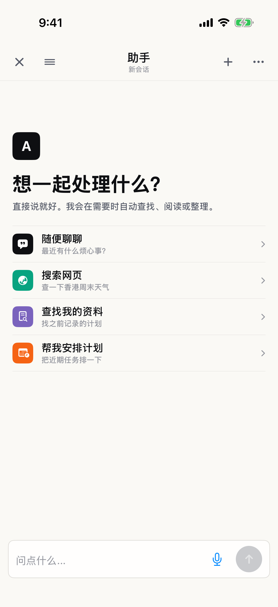
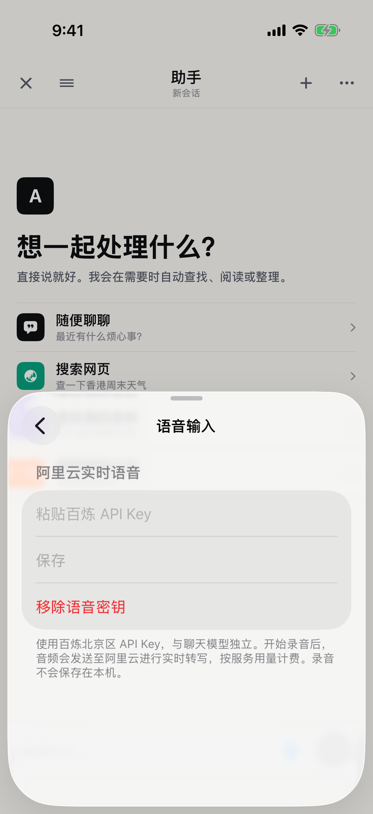

# 实时语音输入验收

2026-09-06 接入记录。2026-09-07 已补充[真机完整链路测试](2026-09-07-physical-speech.md)：录音到真实 AI 回复通过，识别中的数字、时间单位及否定细节仍有遗漏，质量验收未通过。下方保留各阶段当时的检查结果。

## 使用

在助手的 `⋯ → AI 服务 → 语音输入` 粘贴百炼北京区 API Key，保存后返回助手。
点击输入框右侧麦克风开始实时转写；说完点 `完成`，等待最后一句定稿后自动提交给当前助手会话。
首次未配置时点击麦克风直接进入语音配置。聊天模型仍单独配置。
取消、退出、切换会话或进入后台不会提交。连接或收尾失败后已识别文字保留在输入框，可手动修改后发送。

## 已通过

- Swift 包协议测试：4 / 4。
- 应用单元测试：27 / 27，其中新增语音测试 8 项。
- 新增助手语音入口及配置页 UI 测试：1 / 1。
- ToughTrialV2Checks、FocusTimelineCoreChecks、swift build。
- iOS Simulator 编译、签名和测试。
- 界面截图人工检查：麦克风可见；独立语音配置正常；无安全存储读取错误。

协议测试覆盖：中间稿替换、定稿保护、按句排序、旧任务隔离、心跳无正文、命令格式。
应用测试覆盖：停止采集后先排空音频再发送 finish-task、仅在完整定稿后提交一次、取消收尾不提交、权限等待期间取消、权限拒绝、错误保稿、意外结束/未定稿不提交、48/44.1/16 kHz 输入转换与末尾排空、密钥读取/新增/更新/移除。

真实麦克风以 AVAudioEngine 采集，转换器停止时显式使用 endOfStream 排空滤波器尾部。测试验证 1 秒输入最终产生 16000 个单声道 Int16 样本（最多容许 1 个样本舍入误差）。

## 测试环境与复现

Xcode 当前安装版本，iOS 26.5 iPhone 17 Pro Simulator。

```sh
swift test --filter V2FunASRTests
swift run ToughTrialV2Checks
swift run FocusTimelineCoreChecks
swift build
/opt/homebrew/bin/xcodegen generate
xcodebuild -project ToughTrial.xcodeproj -scheme ToughTrial \
  -destination 'platform=iOS Simulator,id=70658AC9-865F-44BC-8FAE-E8762E4F6824' \
  -only-testing:ToughTrialV2AppTests \
  -only-testing:ToughTrialUITests/ToughTrialUITests/testAssistantOffersRealtimeSpeechAndIndependentSettings \
  CODE_SIGNING_ALLOWED=YES CODE_SIGN_IDENTITY=- test
```

受限沙箱下实际执行为 Swift 使用 `/private/tmp/tough-trial-review-build` scratch path 与临时 module cache，Xcode derived data 为 `/private/tmp/tough-trial-speech-build`。模拟器服务与代码签名通过获准的主机命令执行。

最终结果包：`/private/tmp/tough-trial-speech-build/Logs/Test/Test-ToughTrial-2026.09.06_01-34-56-+0800.xcresult`。

早期未签名包虽能展示入口，但 Keychain 读取失败；已改用签名包，并增加安全存储往返测试与错误文案不存在断言。最终签名包全部通过。





## 已验证与尚待验证的边界

### 2026-09-07 真机检查

- iPhone 13 Pro、iOS 27.0（24A5424a），Xcode 26.6。解锁后开发服务正常连接。
- 真机目标编译、开发签名、安装更新成功；保留原应用数据。助手页成功启动。
- `ToughTrialDeviceSpeechTests.testPhysicalDeviceSpeechConfiguration` 使用设备现有配置，禁用模拟 AI 测试环境。
- 结果为 **1 项跳过**：助手显示“先连接 AI”，没有聊天服务配置，尚未进入录音。不能将 Xcode 的 `TEST SUCCEEDED` 作为语音端到端通过证据；语音密钥是否存在也尚未检查到。
- 结果包：`/private/tmp/tough-trial-device-signed/Logs/Test/Test-ToughTrial-2026.09.07_01-13-40-+0800.xcresult`，包含 `physical-device-assistant-readiness` 截图。
- 待补齐设备配置后，继续验证真实麦克风转写、点完成后的最终提交、AI 回复与各阶段耗时。

### 2026-09-07 设备配置前的服务可用性检查

- 用户授权在测试手机安全保存个人百炼 Key；其他用户的开通与配置体验已另记到 `docs/roadmap.md` 的新增待办。
- 百炼北京控制台提示账号欠费。使用已授权的现有 Key 在本机进程内存中执行最小请求：`fun-asr-realtime` 的 `run-task` 返回 `task-failed / Arrearage`；专属域名上的 `qwen-flash` 聊天请求返回 HTTP 403、`AccessDenied.Unpurchased`。
- 两项请求均未成功。聊天错误只证明当前模型访问被拒绝，不能断言充值后必定恢复；需重新验证模型权限。
- 尚未将该 Key 或不可用的聊天配置保存到手机。Key 未写入源码、安装包或本地凭据文件；临时进程结束后清除本次传递状态。
- 此检查来自 Mac 的真实服务请求，不是 iPhone 麦克风验收。完整真机流程仍等待账号服务恢复及设备配置。

### 2026-09-07 充值后复查

- 用户处理欠费后，`qwen-flash` 最小聊天请求返回 HTTP 200 和有效回复；实时语音探测最终返回 `task-finished`。前一次静音探测返回 `EmptyAudio`，不能作为实际转写证据。
- 已准备仅显式开启时运行的真机加密配置测试，以及“真实麦克风 → 点完成 → 真实 AI 回复”的 UI 测试。固定中文测试音频长约 9.81 秒，包含“三点改成四点”的口头纠正和“不修改日程、只回复测试成功”的限制。
- 设备配置测试当前停在系统 `Unlock sky to Continue`；设备查询确认 `passcodeRequired: true`。尚未运行加密导入及语音 UI 测试，不能把脚本准备完成记为真机验收通过。

- 前序 Python 测试器已完成真实百炼 100 秒录音对比：实时结束后 0.41 秒收尾，录音 Flash 全文件请求 6.01 秒。该结果证明服务可用，不是本轮 iOS 客户端的实测延迟。
- 本轮自动化模拟了网络事件及采集流；尚未用真机麦克风跑完整真实请求，也没有将账户密钥嵌入 App。
- 没有执行真实账户的日程写入；AI 自动改日程、高亮、整次撤销、可选确认、同步和额外使用 trace 不在本轮实现范围。
- 用户录音仅流式发往百炼，不落盘；最终逐字稿按现有助手用户消息保存。密钥只保存在设备安全存储，不写任务 JSON 或日志。

接口依据：[百炼实时协议](https://help.aliyun.com/en/model-studio/fun-asr-realtime-websocket-api)、[客户端事件及心跳](https://help.aliyun.com/en/model-studio/fun-asr-client-events)、Apple 本机 SDK `AVAudioConverter.h` 的 end-of-stream 转换说明。
