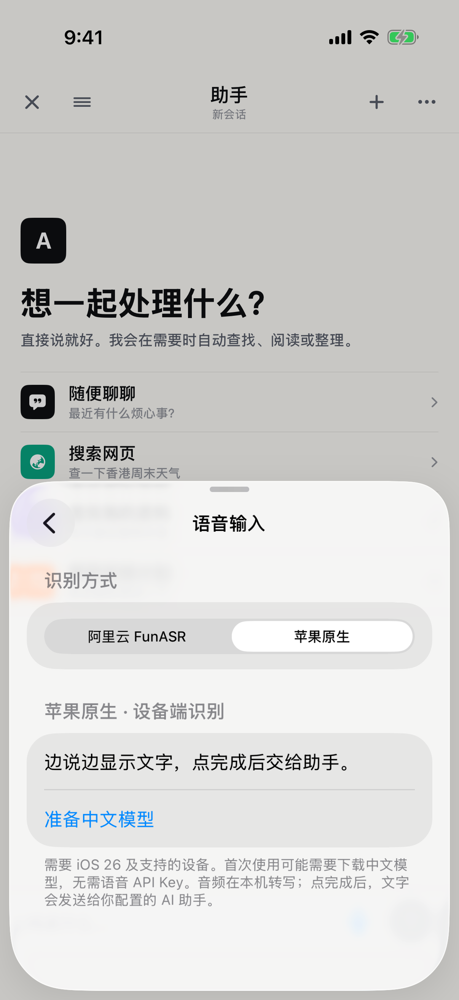
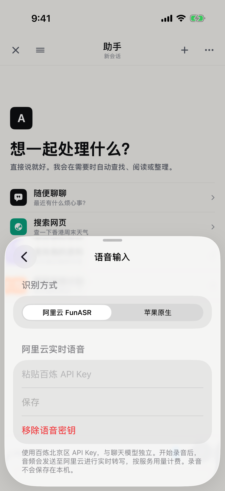

# 苹果原生 / FunASR 语音切换验收

2026-09-07。**切换功能通过，苹果中文模型已在 iPhone 13 Pro 验证，苹果与 FunASR 均跑通麦克风到 AI。** 最新结果见[真机对比](2026-09-07-speech-comparison.md)。下方保留首次切换功能验收时的分阶段记录。

## 已交付

- 助手右上角“⋯ → 语音输入”可切换苹果原生与阿里云 FunASR；AI 服务页也可进入。
- 设置自动保存，重启后保留；已有默认仍为 FunASR，切换不删除已有密钥。
- 苹果路径使用 iOS 26+ SpeechAnalyzer / SpeechTranscriber，检查硬件和中文支持，按需下载端侧模型；支持提前准备。不可用时说明原因，不自动调用云端。
- 麦克风 → 实时文字 → 点完成 → 等最终稿和音频收尾均成功 → 一次交给现有 AI。录音时显示当前识别方式。
- 取消、离开、切换会话、后台、服务错误均保留可见草稿且不自动提交。未增加音频存档。
- 今天和旧计划页的旧版苹果识别保持原状。

## 验证证据

- `swift run ToughTrialV2Checks`：通过。
- `swift run FocusTimelineCoreChecks`：通过。
- `swift build`：通过。
- iOS 模拟器：**18 项通过，0 失败、0 跳过**，其中苹果 9 项、现有 FunASR 8 项、设置界面 1 项。
- 苹果测试覆盖草稿修订、迟到临时稿保护、完成后只提交一次、收尾失败不提交、取消、权限拒绝/等待中取消、服务失败、路由隔离、采样转换与尾部排空。
- UI 测试实际点击两种设置，验证苹果页隐藏语音 Key、重启保留选择、菜单可进入、切回云端显示配置。已人工查看截图。
- 第一轮长按入口测试触发录音而未打开菜单，已移除该入口，改为明确菜单项，最终复测通过。
- 最终结果包：`/private/tmp/tough-trial-apple-final-tests.xcresult`。
- 最终模拟器日志：`/private/tmp/tough-trial-apple-final-tests.log`。
- 真机签名构建：`/private/tmp/tough-trial-apple-final-device-build.log`，TEST BUILD SUCCEEDED。
- 最新构建通过 devicectl 安装到原 bundle `com.skyliu.toughtrial`，保留现有配置和数据。真机启动收到 Locked，故本轮没有实际录音和云端费用。

## 首次切换验收时尚待验证（已补后续结果）

真机苹果中文模型准备、真实麦克风转写、点完成后 AI 回复，以及同一音频/自然口述的质量与延迟对比，均尚未完成。不得将模拟器生命周期测试当作真实模型识别成功的证据。后续重点评估数字、时间单位、否定表达和临时改口。

现有真机测试 `testPhysicalDeviceSpeechToAssistant` 支持 Runner 环境 `TOUGH_TRIAL_DEVICE_SPEECH=1` 和 `TOUGH_TRIAL_DEVICE_SPEECH_PROVIDER=apple`（或 `funASR`），会通过 UI 选择识别方式，不改变应用默认逻辑。需要手机解锁和固定测试语音输入；默认测试不录音。

## 界面证据

## API 依据

[Apple WWDC25 SpeechAnalyzer 介绍](https://developer.apple.com/videos/play/wwdc2025/277/)，以及本机 iOS 26.5 Speech.framework Swift 接口；运行时使用 isAvailable、supportedLocale 和 assetInstallationRequest 检查和准备资源。
