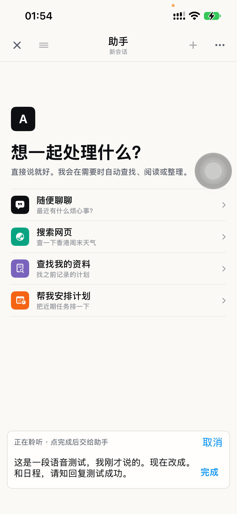
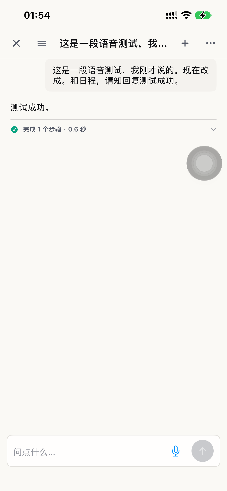

# 真机实时语音测试

2026-09-07。结论：**录音到 AI 回复的链路通过；语义细节保留尚未通过。**

## 设备与方法

- iPhone 13 Pro，iOS 27.0，Xcode 26.6；真机开发签名安装，保留应用数据。
- 百炼 `fun-asr-realtime`，聊天模型 `qwen-flash`。用户授权的 Key 已保存到手机安全存储，没有嵌入安装包或测试参数。
- Mac 内置扬声器播放 macOS Tingting 合成语音，由 iPhone 的真实麦克风拾音，经应用采集、转换和 WebSocket 发送至百炼；不是注入模拟 PCM。源文件 9.81 秒，播放进程约 10.6 秒。
- 测试句：“这是一段语音测试。我刚才说的是三点，现在改成四点。不要修改任何日程。请只回复测试成功。”
- Mac 原输出音量约 19%，原静音状态在播放期间临时解除，结束后恢复。声源距离、环境噪声和实际声压未校准。

## 结果

`ToughTrialDeviceSpeechTests.testPhysicalDeviceSpeechToAssistant`：1 项通过，0 失败。

| 观察项 | 本轮结果 |
| --- | --- |
| 点完成前 | 已出现转写，未开始聊天请求 |
| 点完成后 | 完成收尾并自动提交，AI 返回“测试成功。” |
| 点击麦克风到首次观察到文字 | 7.69 秒，包含测试等待和启动播放，不能作为纯 ASR 首字延迟 |
| 点击完成到录音 UI 退出 | 1.61 秒 |
| 点击完成到观察到 AI 回复 | 2.74 秒 |

以上均为一轮 XCTest 界面观察耗时，包含点击、系统等待和查询开销，不是服务端耗时或统计性能指标。

最终逐字稿：“这是一段语音测试，我刚才说的。现在改成。和日程，请知回复测试成功。”

该稿遗漏了 3 / 4 及否定语义。前一轮能保留“3 改成 4”和“不要修改任何日程”，但丢失“点”，且把“只回复”识别为“知回复”。因此此次测试不能证明识别精度可靠，也不能据此自动创建或修改真实日程。需要用自然口述、明确声源距离和噪声条件进一步判断原因，不能只归因于模型或只归因于扬声器拾音。

## 发现并修复

1. 真机麦克风回调崩溃：Swift 6 将主线程上下文创建的音频回调推断为 MainActor 隔离；系统在音频线程调用时触发执行器断言。将回调明确标记为 `@Sendable`，转换器原有锁继续保护转换与停止排空。失败真机测试复现后，修正版本完成真实采集。
2. 百炼回复兼容：模型返回 `{"action":"answer","text":"测试成功"}`，旧解析器要求连未使用的 `query` / `url` 也必须存在。现在允许省略未使用字段，仍校验操作必需内容、字段类型、HTTPS URL 和冲突字段。核心检查先复现失败，修复后通过。
3. 真机 UI 测试启动：`test-without-building` 自动选择 `arm64e` 时出现 CPU 类型错误；指定与构建产物相符的 `arch=arm64` 后正常启动。

## 回归与证据

- 语音单元测试 8 / 8 在真机通过；核心 `ToughTrialV2Checks`、兼容检查 `FocusTimelineCoreChecks`、`swift build` 和真机测试构建通过。
- 解析器回归覆盖五种操作省略空字段，以及缺少必需字段、冲突字段继续失败。
- 最终结果包：`/private/tmp/tough-trial-device-setup/speech-ui-final.xcresult`。
- 真机崩溃及修复后单元测试：`speech-ui-arm64.xcresult`、`speech-ui-sendable.xcresult`，位于同一临时目录。
- 临时加密导入脚本只用于本次授权配置；手机导入成功后清除了临时交换文件及临时私钥。测试源码已从项目移出，留在上述本地证据目录。

## 后续复测

构建后，在生成的 `.xctestrun` 中给 UI 测试 Runner 设置 `TOUGH_TRIAL_DEVICE_SPEECH=1`，仅运行上述真机语音测试，目标显式指定 `platform=iOS,arch=arm64,id=<device-udid>`。该测试默认跳过，避免普通测试意外录音或产生云端调用。

测试观察到 `DEVICE_MIC_RECORDING_READY` 后播放固定句，正常收尾后验证真实 AI 回复。测试 App 通过 `TOUGH_TRIAL_DEVICE_KEEP_AWAKE=1` 在前台最多保持亮屏 10 分钟；仅 Debug 构建生效，不改变系统自动锁定设置，也不能通过密码锁屏。测试结束后正常重启 App 即恢复普通运行模式。
