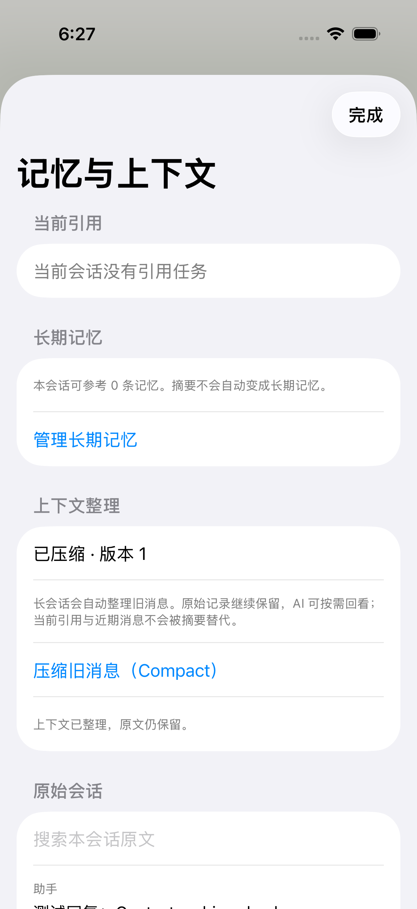

# 助手上下文、日志与两个实际问题验收

日期：2026-09-10。正常包版本：1.0 (3)。

## 交付

- 保留原有 workspace、memory 和业务 snapshot；增加本地 `assistant-context/` 归档。
- `sessions/<id>.jsonl` 保存公开消息修订及事件；`session-index.json` 支持检索；`memory/MEMORY.md` 和 `memory_summary.md` 为结构化记忆投影；`compact/<id>.json` 保存有来源的摘录与版本。
- 长会话超过 20 条、16,000 字符时自动压缩旧消息，保留最近 12 条。也可手动调用 Compact。摘要按预算保留各消息摘录，空间不足优先近期决定；原始 workspace 不删除。
- AI 具有实际宿主工具：查记忆、搜会话、读原文、读 Trace、Compact。遵循模块启停；没有任意文件路径执行能力。
- 聊天、日程生成、动态工具共用引用、记忆、Compact、日期/时区；Trace 记录引用 ID/状态、记忆 ID、摘要版本和上下文规模。
- 助手新增独立“记忆与上下文”入口，复用既有长期记忆管理。压缩不自动写永久记忆。

## 两个实际会话的问题

1. 引用任务仅存在 session.sourceTask，原路由/排期请求未携带。现按 ID 刷新引用并显式传入；查询包含当前引用，不受听写同音字影响。拆分提示要求主动生成可执行步骤，真实缺失信息才澄清。
2. 历史日程失败后，hello 被模型重新解释为写入授权。现由宿主在生成前及执行前校验本轮意图；动态写入共用规则。仅紧邻成功澄清可继承明确请求，失败、问候、否定和讨论不授权。

同时修正“今天新增”只产生任务、未产生当天计划项的问题；沿用手动输入的数据和 Today 展示，并支持一起撤销。

## 验证证据

- 先写 App 回归：3 个实际问题对应测试均失败，共 7 条断言，`/private/tmp/tough-context-app-red.log`。
- 最终 Core：187 项，183 通过、4 项远端 opt-in 跳过、0 失败；`/private/tmp/tough-context-core-final.log`。
- 实际手机导出副本已纳入上述 opt-in 回归：最近两个会话导入幂等、压缩后消息数保留、hello 拒绝写入、原导出文件字节未改。个人消息只在临时目录，不进入仓库。
- 最终 App 模拟器：119 项，113 通过、6 项设备/远端 opt-in 跳过、0 失败；`/private/tmp/tough-context-app-final.log`。
- 既有 Keychain 用例在未签名模拟器出现 -34018，在最终模拟器 run 中显式排除；18:34 已在签名真机测试中通过。
- 新 UI 测试通过：入口、记忆管理、原文读取、Compact 成功反馈。截图见下。
- `ToughTrialV2Checks`、`FocusTimelineCoreChecks`、`swift build` 和 `git diff --check` 通过。
- 真机正常签名 build 成功。18:30 安装到 iPhone 13 Pro 成功，包版本 3；首次启动因 Locked 拒绝。18:33 解锁后正常启动成功，18:35 测试结束后再次正常启动成功。
- 真机 21 项 / 0 失败：15 项日程回归、5 项上下文集成、1 项 Keychain 读写。引用请求、误写拦截、Today 计划、记忆/原文/Trace/Compact 实际宿主工具均通过；模型使用确定性测试响应。
- 只读导出手机新归档并与当前 workspace 对照：12 个会话、38 条消息全部匹配。正常重启后所有 JSONL 文件字节一致，无重复追加。个人原文保留在临时目录，未提交仓库。

模拟器结果：`/private/tmp/tough-trial-recorded-sim/Logs/Test/Test-ToughTrial-2026.09.10_18-28-27-+0800.xcresult`。
UI 结果：`/private/tmp/tough-trial-recorded-sim/Logs/Test/Test-ToughTrial-2026.09.10_18-27-16-+0800.xcresult`。
真机测试结果：`/private/tmp/tough-trial-context-device/Logs/Test/Test-ToughTrial-2026.09.10_18-34-17-+0800.xcresult`。
正常启动回执：`/private/tmp/tough-context-launch-retest.json`、`/private/tmp/tough-context-phone-final-launch.json`。
安装/首次启动回执：`/private/tmp/tough-context-install.json`、`/private/tmp/tough-context-launch.json`。

## 边界

复用的是本机可观察的 Codex 存储职责，不是其私有运行时。新日志和记忆投影仅本地保存；Compact 是确定性摘录，细节靠原文回查；本轮没有使用真实 GLM 再次生成课程拆分来评价内容质量。写入判定采用有界语言规则，后续可用真实 Trace 继续扩充自然表达覆盖。

## 18:37 真实使用复发：口语误拦截（修复版 1.0 (4)）

- 用户本轮说“来分一下这个任务喽”，App 返回“本轮没有明确的日程修改请求”。Trace 的 contextPrepared 已包含正确 referenceID，referenceState=available；这次不是引用漏传。
- 根因：新增宿主写入规则识别“拆分”，但没有覆盖“分一下”等口语。模型已选择日程路径，宿主误拒绝，排期模型未调用。上一批确定性测试没有覆盖该自然表达，不能据此宣称真实对话已解决。
- 修复：扩充任务拆解口语，保留否定、纯讨论、问候限制；将实际原话替换进 App 引用回归。
- RED：新增口语样本 5 个断言失败，`/private/tmp/tough-colloquial-red.log`。GREEN：25 项意图测试通过，完整 Core 188 项 / 5 跳过 / 0 失败，App 上下文+日程 20 项通过。
- 新增可显式触发的真实 GLM 测试：使用独立 Engine/MemoryEngine/Workspace 和完全虚构教材，验证生成至少两个真正关联的子任务及 hello 无写入，不读写个人日程。包含私人课程标题的初次测试调用被自动审批拒绝；改成完全虚构测试数据后获准，但手机断连，尚未执行成功。
- 1.0 (4) 安装与真实模型验证待手机重连。当前手机仍为 1.0 (3)，本次没有提前宣称修复已验收。
