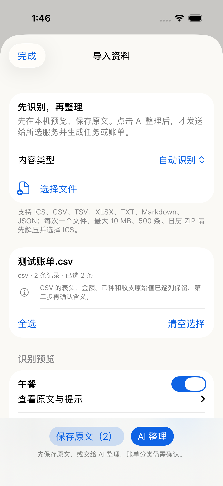
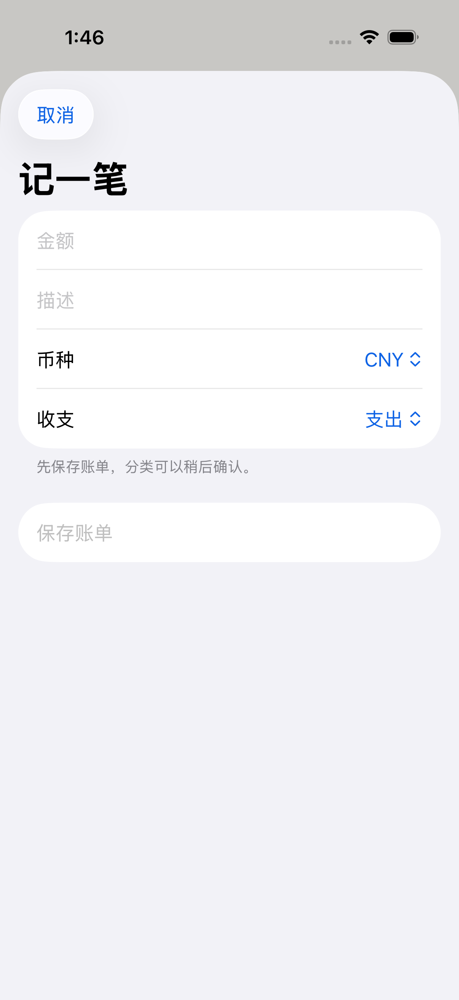

# 快速模型、外部导入与主屏幕小组件验收

日期：2026-09-10。范围：当前 iOS 原型；云端快速模型预设、标准导出文件导入、iPhone/iPad 主屏幕入口。

## 可用功能

- 新用户默认 `GLM Coding Plan / glm-5.3-flash`。新增独立 `MiniMax / MiniMax-M2.7-highspeed` 预设及快速推荐按钮。旧 provider/model/key 保留；MiniMax 使用其自己的 API Key。云端模型，不是离线推理。本次没有用真实模型跑速度对比。
- 随手记 → 导入资料：本机识别一个文件 → 预览并选择 → 保存原文，或明确点击 AI 整理。原文件保存在附件库并可再次导出；同一文件、同一条记录重复导入不重复创建。
- ICS、CSV、TSV、TXT、Markdown、JSON/DayOne、XLSX。10 MiB / 500 条上限；AI 每轮最多 10 条。大文件可先存全部、分批整理。ZIP 日历导出先解压选 ICS。
- 导入原文先进入 Capture，不直接写任务或账单；第二步复用既有 schema 校验、任务/回想/理账命令和 trace。账单仍处于 Others/待确认，分类需人工确认。
- 重复/例外/取消、缺 DTSTART 或未知 TZID 的 ICS 原文保留；数据层禁止把这些来源直接变成 task。完整循环日程展开尚未实现。
- WidgetKit：一个中号三入口组件，以及记账、待办、随手记三个小号组件；保留 Live Activity。组件打开 app 对应输入页。忙碌时保留最近点击的入口，草稿先保存。

## 验证证据

- `swift test --filter ToughTrialCaptureTests`：38 项通过（含 9 parser 测试：乱序工作表关系、外部关系不解析、实际 Deflate 压缩和 CRC 损坏校验）。
- `swift run ToughTrialV2Checks`、`swift run FocusTimelineCoreChecks`、`swift build`：通过。
- iOS App tests：9 项通过，覆盖 3 项模型设置、6 项 CaptureStore；包括批量账单待人工确认、重试不重复、原文/批次对应、失败提示和原文保留。
- iOS UI：5 项通过，覆盖导入预览→保存→回看、快捷记账、快捷待办→标准任务列表、实际 URL 冷启动、从理账启动整理后回到记录结果页。
- XCUIApplication.open 会重启测试进程，不能拿它当热启动草稿保存测试；草稿保存由 Store 测试验证。
- 真机签名构建通过，新版已安装并成功启动到连接的 iPhone 13 Pro（日志见下）。小组件已修正系统默认边距与内部边距叠加导致的高度风险。
- 第二轮 UI 发现保存反馈不在当前视口，已将保存反馈和打开记录放到底部固定区域，并通过回归。复查发现从理账开始整理时失败提示可能不可见，已统一切到记录结果页，并增加失败提醒；相应 App/UI 回归通过。

关键运行记录：

- `/tmp/tough-trial-import-parser-final.log`
- `/tmp/tough-trial-import-release-tests.log`
- `/tmp/tough-trial-import-device-release.log`
- `/tmp/tough-trial-import-install.log`
- `/tmp/tough-trial-import-launch.log`
- `/tmp/tough-trial-recorded-sim/Logs/Test/Test-ToughTrial-2026.09.10_01-45-19-+0800.xcresult`
- `/tmp/tough-trial-import-checks.log`
- `/tmp/tough-trial-import-compat.log`
- `/tmp/tough-trial-recorded-sim/Logs/Test/Test-ToughTrial-2026.09.10_01-28-51-+0800.xcresult`
- `/tmp/tough-trial-recorded-sim/Logs/Test/Test-ToughTrial-2026.09.10_01-35-48-+0800.xcresult`
- `/tmp/tough-trial-recorded-sim/Logs/Test/Test-ToughTrial-2026.09.10_01-37-47-+0800.xcresult`（批量测试通过，旧热启动用例测试方法不正确；已改为真实冷启动验证）

## 截图

## 验收边界

- MoneyThings 验证使用兼容表格 fixture，没有用户真实导出样本。其专有备份、旧 XLS、PDF 不在当前支持范围。
- 日历支持标准 ICS 文件；没有接 Google/Apple/飞书/Teams 账号自动同步或授权接口。
- 没有 Mac 原生应用/独立 Mac 桌面输入组件，也没有手机离线模型。
- Widget 已构建打包，三路由的页面行为已测；尚未完成在主屏幕实际添加组件并逐个点击的真机人工验收。
- 云端真实抽取质量/速度、多设备原文件同步、本轮未覆盖。当前 Capture 原文/附件仍仅在本机保存。
