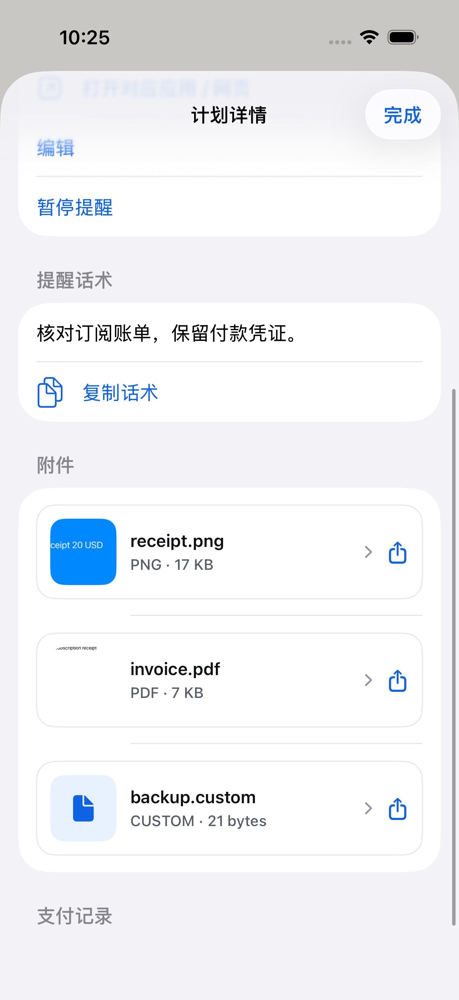
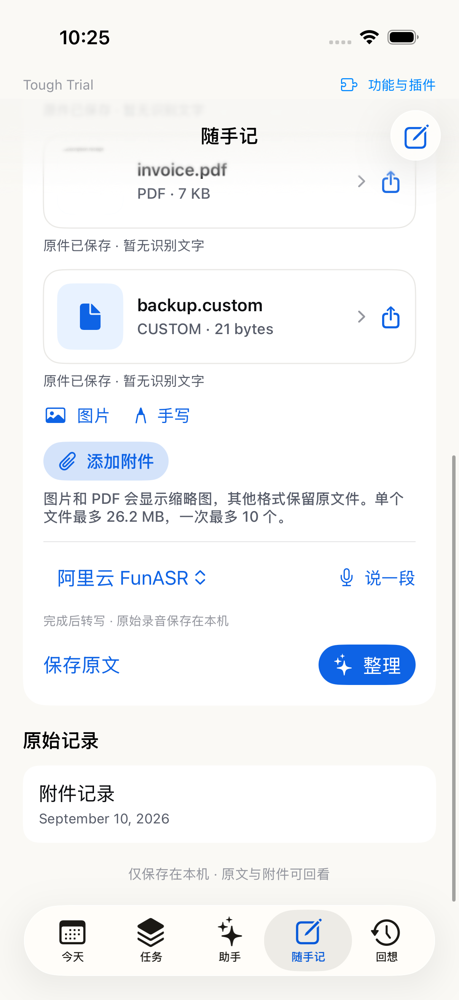

# 理账计划、附件与插件验收记录

日期：2026-09-10。主目录实现已保留，最新版于 10:26 安装到 sky iPhone 13 Pro，10:27 `devicectl` 启动成功。

## 可用入口

- 随手记 → 添加附件：多选文件；图片/PDF 缩略图；其他格式显示文件图标与扩展名；原件可预览或分享。
- 随手记 → 理账 → 订阅、还款与预算：新增订阅/待付账单/信用卡/房租/借款还款。附件位于新增或编辑计划表单中。
- 计划详情：编辑、暂停、打开关联应用/网页、复制话术、确认已支付并记账、撤销。
- 月度预算：同币种实际支出，可选分类；转账不占消费预算；撤销支付后恢复。
- 页面顶部 → 功能与插件：持久化启停、依赖关系、导入声明式 JSON 表单插件。示例见 `docs/plugins/reading-note.json`。

## 实现与数据边界

`V2FinanceModels/Engine` 管理财务 schema 和原子命令；所有实付账单进入既有 `capture.ledger`，沿用分类确认入口。计划、附件引用和支付回执存入本地 snapshot；附件原件以不可变文件存储。UI 不直接改变 snapshot。Trace 记录理账修改/失败、关联计划或支付 ID 与耗时，不包含正文或付款资料。

原始文件先保存，预览不向模型上传文件。单文件 25 MiB（界面按十进制显示约 26.2 MB），单次最多 10 个，一条记录/计划最多 20 个附件。未知扩展名也能保留，以原文件名分享。分享不允许外部 App 原地编辑本地原件。

## 验证

- `swift test --filter ToughTrialCaptureTests`：50/50 通过，含财务 9 项、插件/schema/附件重载以及既有 Capture 和导入测试。
- App 附件测试：7/7 通过，含任意格式、音频类型、文件数/大小/空文件/目录、图片与 PDF 实际 Quick Look 缩略图、未知格式回退、分享原名与内容 hash。
- App 集成测试：3/3 通过，含保存并重新打开文件、插件安装和启停持久化、提醒时区/提前日期/暂停。
- 新增 UI 流程：2/2 通过。新增订阅，停用/恢复理账且数据不丢；两个页面显示同一组附件，支付、撤销、预算恢复。
- 原有导入/快捷录入 UI：5/5 串行重跑通过。一次并行验证中，另一 worktree 的测试安装覆盖了同一模拟器 App，导致 AX 窗口错误及入口缺失；停止并行、重新安装主目录版本后全部通过。
- `swift run ToughTrialV2Checks`、`swift run FocusTimelineCoreChecks`、`swift build`、`git diff --check` 通过。
- iOS Simulator 构建通过；iPhone 13 Pro 签名构建、安装、启动成功。

相关 XCTest 结果：

- `/private/tmp/tough-trial-recorded-sim/Logs/Test/Test-ToughTrial-2026.09.10_10-25-10-+0800.xcresult`：附件 7 项 + 附件/支付 UI 1 项 + 旧 UI 5 项均通过。
- `/tmp/finance-core-final.log`：50 项 Core 测试。
- `/tmp/finance-final-tests2.log`：集成 3 项及新增 UI 2 项通过；随后旧 UI 被并行安装干扰，以上串行结果替代该部分。
- `/tmp/finance-attachment-final.log`：分享安全选项与特殊扩展名的最终附件测试。
- `/tmp/finance-device-install-build.log`、`/tmp/finance-device-install.log`、`/tmp/finance-device-launch.log`：真机构建/安装/启动。

## 截图

截图来自模拟器、使用测试凭证；不包含用户实际账单。

## 尚未验收的外部行为

- 真实日期到达时的通知送达、锁屏通知点击，以及各第三方 App scheme 跳转尚未真机逐项测试。请从理账计划页「开启 / 更新提醒」授予通知权限；已实现本地排程，尚不等于已证明送达。
- 文件选择器使用系统「文件」，不同 iCloud/第三方文件提供者的授权与下载行为没有全部逐一测试。
- 本轮没有发起支付或发送话术；新财务数据与文件尚不参加 GitHub/云端同步。
- 插件当前为原生内置模块开关 + JSON 表单/模板，不兼容 Obsidian JavaScript 插件。更细的内置模块生命周期、脚本扩展与助手直接生成财务计划属于后续阶段。
