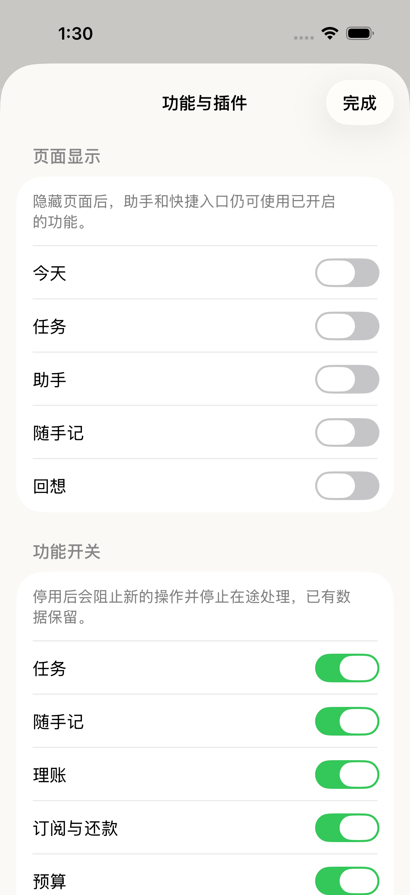
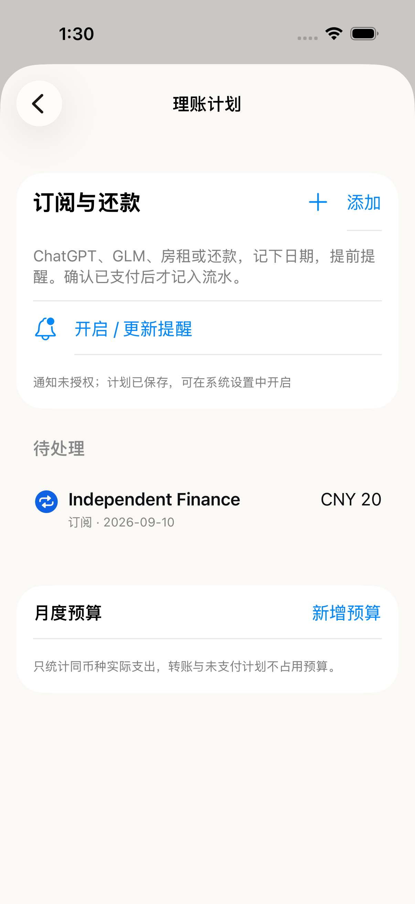

# 插件运行时与统一契约：第一批验收

日期：2026-09-10。范围是运行时可用性主干与 Finance 命令试点，完整设计仍按路线图迁移。

## 现在可以使用

- “功能与插件”分为**页面显示**与**功能开关**。隐藏页面不改变业务能力；停用会阻止新的命令。全部页面隐藏后，仍能打开管理面板并恢复。
- Ledger 不再依赖 Capture，Finance / Budget 依赖 Ledger。关闭随手记后，可从功能管理进入订阅、还款与预算。
- 旧设置只迁移一次，并保留 v1 偏好备份。原先因为依赖而暂停的功能不会在升级后静默恢复；显示暂停原因和恢复入口。Trace 原有关闭选择保留。
- 未知模块、缺失依赖、循环依赖不能执行。用户的开启意愿与依赖导致的实际暂停分开记录。
- `V2Engine.commit(modules:)` 在事务边界授权；任务、规划、回想、Capture、分类、Finance、预算、导入、同步均指定业务域。Capture 的跨域生成、替换和撤销检查目标域，临时 Engine 继承运行时。
- AI 整理、助手工具、语音完成、GitHub 同步检查开始时的 generation；关闭再开启也不会放行旧结果。文件后台协调器与系统导出通过可撤销 lease 检查。图片/PDF/原文件的历史读取不依赖附件输入开关。
- 财务表单使用 6 类 typed commands：保存计划、启停计划、确认已支付、撤销支付、保存预算、删除预算。支付要求宿主人工确认；后台及声明式插件不能确认支付。
- Finance draft 只接受登记的可写字段，拒绝模型伪造 id / revision / confirmation / trace。现有 Engine 仍执行金额、日期、附件、版本等最终校验。
- 支付统一回执直接投影已有 `V2FinancePayment`；重开可恢复，重复提交同一期不重复记账。没有真实撤销能力的命令不显示虚构 undoRef。Trace 关闭不影响这些业务记录。
- 财务操作 Trace 增加 moduleID / commandID / traceID；不记录正文、附件内容、模型密钥。历史支付记录没有原 Trace 关联时保持 nil，不补造数据。

## 验证结果

| 验证 | 最终结果 | 证据 |
| --- | --- | --- |
| `swift test --scratch-path /private/tmp/tough-runtime-root --filter ToughTrialCaptureTests` | 80 / 80 通过 | `/private/tmp/tough-runtime-core-all.log` |
| `swift run --scratch-path /private/tmp/tough-runtime-root ToughTrialV2Checks` | 通过 | `/private/tmp/tough-runtime-v2-checks.log` |
| `swift run --scratch-path /private/tmp/tough-runtime-root FocusTimelineCoreChecks` | 通过 | `/private/tmp/tough-runtime-compat-checks.log` |
| `swift build --scratch-path /private/tmp/tough-runtime-root` | 通过 | `/private/tmp/tough-runtime-build.log` |
| iOS App tests：PluginRuntimeIntegration / FinanceIntegration / CaptureStore / AssistantSchedule | 26 / 26 通过 | `/private/tmp/tough-runtime-final-ios.log` 中 App test suites；该轮另有 UI 定位失败，下面单独重跑通过 |
| iOS UI tests：PluginRuntime / FinanceAndAttachment | 4 / 4 通过 | `/private/tmp/tough-runtime-final-ui.log`，13:30 完成 |
| iOS 最终 build | 通过；仅最后的依赖原因文案调整后再构建 | `/private/tmp/tough-runtime-final-build.log` |
| `git diff --check` | 通过 | 主线程检查 |

模拟器：iPhone 17，`299D8057-8839-46FB-B53E-B7F98577E021`。
最终 UI 结果包：`/private/tmp/tough-trial-recorded-sim/Logs/Test/Test-ToughTrial-2026.09.10_13-28-37-+0800.xcresult`。
本轮未安装到真机，未以真实模型或真实 GitHub 仓库执行网络回归。Core 的 GitHub 测试使用假传输，验证读取期间关闭再开启后 PUT 次数为 0。

关键用例覆盖：

- 未知 ID、依赖环、缺失依赖；页面显隐不改变 ticket；依赖关闭以及关闭再开启使旧 ticket 失效。
- legacy Today / Tasks 共用任务域；Capture 旧依赖暂停的迁移保持；Trace false 保留；community 偏好与未知 ID 保留。
- Core 直接调用不能绕过停用；混合 Capture 写入已停用的 Ledger / Tasks 不产生目标数据；禁用附件输入时不写原件。
- Finance 支付确认、重复付款幂等、支付与流水原子性、后续修改保护、撤销与重启回执投影。
- 延迟返回的 AI Capture 请求在停用再开启后不写新 batch；快捷任务目标关闭时连中间原文也不新建。
- UI 隐藏所有页面再恢复；关闭 Capture 后独立创建订阅；Ledger 关闭再恢复保留计划；订阅/随手记附件展示、支付和撤销。

过程修正：独立审查补齐了工具临时开启后的单独 ticket、文件写回后的 lease 校验与 FileDocument 导出时校验。UI 初次失败来自同名“完成”误匹配底层回想按钮；管理按钮增加 `plugins.done` 后重跑通过。全部隐藏时同时移除空 TabView，避免无效选中项。

## 界面证据

以上截图已由主线程查看；长列表可滚动，状态和操作按钮没有遮挡。本机模拟器未授权通知，截图据实显示“计划已保存”。

## 下一批仍需完成

1. 为任务、随手记、分类等其余领域增加统一 command descriptor / envelope / receipt 适配。当前共用事务授权，只有 Finance 完成 typed dispatcher 试点。
2. 完整模块受限 context、owned-job 清理（包括运行中执行会话/Live Activity 的停用策略）、持久化通知 outbox。当前通知按快照重排，有失败提示与下次重试，尚不是通用持久化作业系统。
3. AI 动态工具目录及财务计划工具、typed 扩展字段、声明包 v2；JSON 表单仍使用 schemaVersion 1，不能自动调用支付命令。
4. 新领域及附件多设备同步协议、版本迁移协调和未知字段保留。当前不扩展 schedule.md 同步边界。
5. 真机通知实际投递、外部 App 跳转、在途网络已发送写入的最终状态恢复。

已发出的远端 PUT 或已经进入系统文件提交阶段的写入不能回滚；本批保证检查点前已失效的请求不会继续写入。通知排程结果与业务保存结果分开显示。
