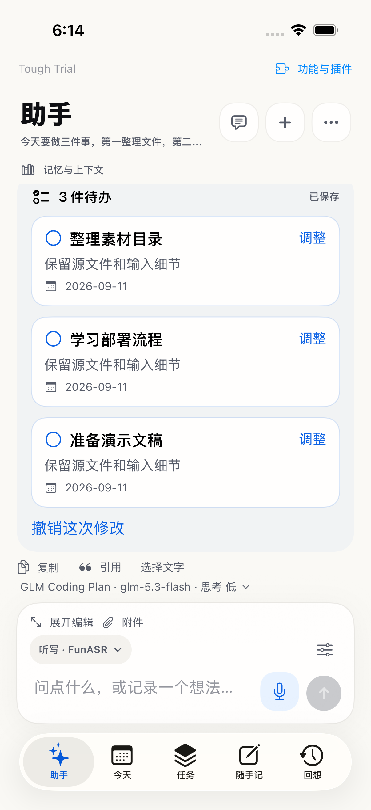

# Assistant task cards — 2026-09-11

## Accepted behavior

Task cards represent extracted tasks; buttons confirm, edit, adjust or undo. A dictated list should enter a structured task workflow rather than end with a text paraphrase and a generic question about what to do next. Unknown write phrasing can generate a reviewable proposal; host authorization and optional strict confirmation still determine whether it may be applied immediately.

## Implementation

- Added enabled-tool-dependent assistant workflows for task organization, ledger capture and context retrieval. Tool parameter schemas still come from the existing registry. Task guidance preserves details, dates, and independence from unrelated old task references.
- Native `core.tasks.schedule` calls now share the existing schedule proposal/confirmation/undo path. Their native call receipts continue to pair with provider results; the UI displays one canonical schedule card instead of a duplicate generic result.
- Added host `requires_review` to schedule requests so the downstream extractor can generate a reviewable proposal for dictated task lists, without mistaking that permission for authorization to save.
- Create plus schedule operations project into one preview per task. Task cards show title, notes, date and supplied time; states distinguish pending, saved, cancelled and undone.
- Pending task edits update only the stored proposal. The same domain engine validates an isolated copy; confirmation remains the point where business records are written. Saved-task adjustment sends an explicit follow-up with the actual task reference.
- Trace context events record tool catalog revision, tool IDs and active workflow IDs, in addition to native continuation counts. No provider reasoning or credentials are added to trace.

## Validation

- Original native-task-list regression failed before the bridge: no schedule card was produced (`/private/tmp/tough-task-cards-red.log`).
- 51 App tests passed: schedule, context and assistant-store suites. Includes three pending task cards, three actual Today plan items, undo, pending edit/reload and invalid edit protection (`/private/tmp/tough-task-cards-app.log`).
- Four schedule UI tests passed in the same run, including edit one of three cards, confirm, verify the edited task in Today, then undo. Screenshot visually inspected.
- 214 core tests passed with five opt-in skips; ToughTrialV2Checks passed (`/private/tmp/tough-task-cards-core-final.log`, `/private/tmp/tough-task-cards-checks-final.log`). The three workflow contract tests, including the additional review-mode wire test, also passed (`/private/tmp/tough-task-card-contracts.log`).
- Final App rerun after review-mode change: 27 tests passed (`/private/tmp/tough-task-cards-app-final.log`).
- Signed device build 1.0 (9) installed by Xcode. Live test passed on iPhone 13 Pro (`/private/tmp/tough-task-cards-live.log`): MiniMax-M2.5-highspeed 10.300 seconds; MiniMax-M2.7-highspeed 8.207 seconds. Each created three cards, preserved notes and independence from the existing task, confirmed three Today entries and undid them. Normal launch succeeded after testing.

Live acceptance uses an isolated engine and synthetic dictated list, including a pre-existing unrelated task reference. It tests MiniMax-M2.5-highspeed and MiniMax-M2.7-highspeed, preserving a note, producing three independent task cards, saving three Today items only on confirmation, and undoing the new records. It does not replay the private phone session or persist test tasks into the user's database.

## Boundaries

This adds built-in workflow awareness based on enabled tools, not a loader for arbitrary external skill files. Model routing is still semantic and requires provider-specific live acceptance; deterministic UI fixtures alone are not proof of live routing reliability. Previously stored text-only replies are not silently converted into tasks.
