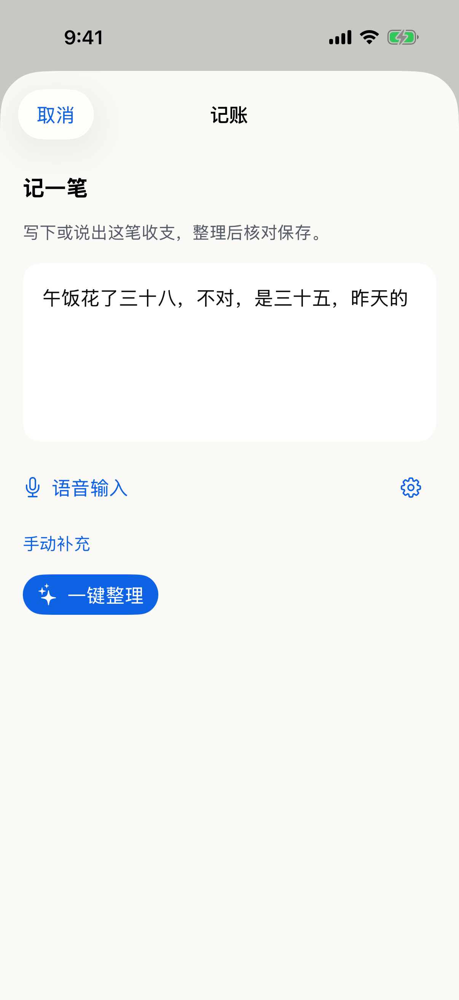
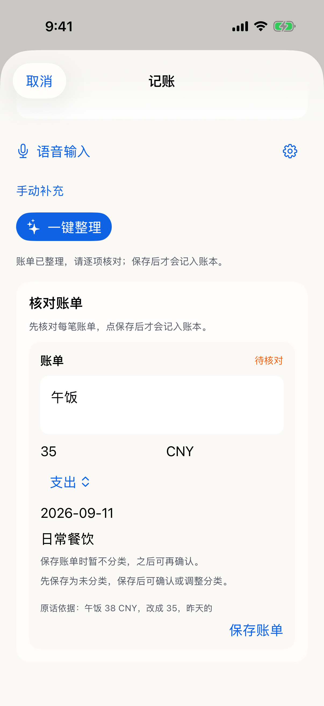
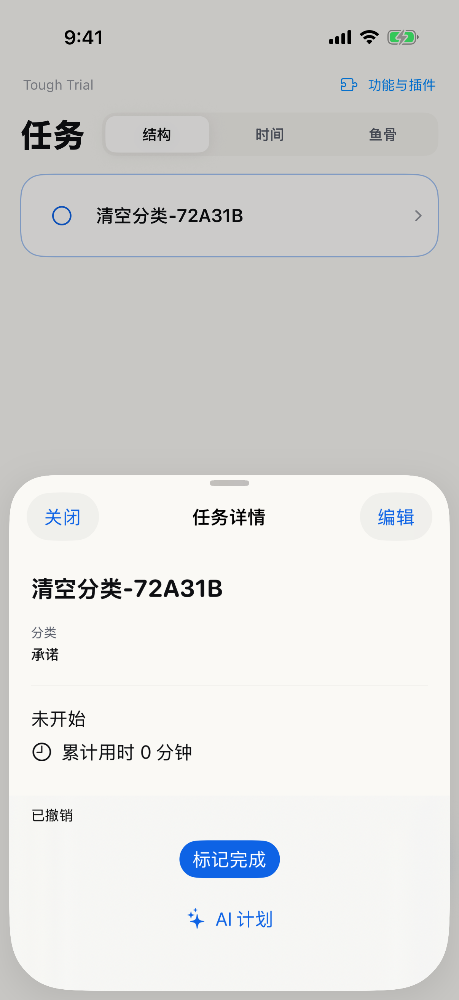

# C 批次：任务分类与轻量记账验收

状态：实现和定向本地回归完成。承接连续文档输入；本轮未安装手机，真实 AI、自然语音、完整真机交互与用户回访仍开放，不关闭 D/E。

## 实际交付

- 任务沿用首段标题、回车后正文。已有任务编辑里默认收起可选分类，支持目标、承诺、维护、未分类；保存更新原任务，保留父子关系、后代、执行和排期，支持取消及冲突保护的撤销。今天没有新增分类标签。
- 随手记的“理账”改为“记账”，沿用现有账本和快捷入口，不新增 Tab。默认一处原文输入，复用 Input 组件及应用主题；一键整理只生成待核对候选，确认后才保存。
- 可修正候选金额、币种、收支、日期、描述与分类建议；未知必需字段须补充，消费日期可留空。正式账单先归 Others，人工确认后才更新类别。原提案与来源保留，人工修正单独记录；重复确认不重复入账，撤销沿原回执。
- 专用记账草稿与混合随手记分离；取消保留原话，“再记一笔”清空当前专用草稿。AI 不可用时仍可手动保存，沿用原有财务命令与回执。

## 验收矩阵

| 表面 | 已验证操作及结果 | 证据 / 剩余范围 |
| --- | --- | --- |
| 任务分类 | 展开、选择、保存、清空；取消→继续编辑/放弃；撤销恢复 | 两种模拟器共 2 条 UI 流程；13 项 App 测试覆盖身份/结构/历史/排期不变、旧基线、重载与写盘失败 |
| 今天 | 分类命令保留任务和排期；源码未向今天新增分类标签 | 本轮未增加今天页面点按用例，真机往返随 E 验收 |
| 记账入口 | 随手记→记账→记一笔；快捷入口；Capture 停用后独立手动记账 | 17e 实际点按通过；其余模块开关组合未逐项重跑 |
| 单一原文 | 文字输入、收起键盘、整理、取消后重开、混合草稿隔离、再记一笔 | 4 条 LedgerReview UI 中覆盖；自然录音、语音设置和超长输入本轮未实测 |
| 核对保存 | 改金额/日期/类别建议后保存当前值；缺金额/币种/收支时禁用，补充后保存 | 17 Pro 与 17e 实际点按；其余字段边界由 Core 验证，所有收支选项及中文精确选区尚未逐项人工点按 |
| 分类 / 撤销 | 保存为 Others，显式确认修改后的类别；撤销移除流水并恢复统计；手动账单也可确认分类 | 专用及手动路径实际点按通过；类别表单所有关闭/拒绝入口未在本轮逐一重跑 |
| AI 失败 | 可见错误→重试成功，原文保持 | 确定性失败一次 fixture；真实网络/服务失败留 D/E |
| 领域边界 | 多笔、重复确认、跨批次防重复、过期来源、已拒绝候选、重载后撤销、磁盘失败原子回滚 | Core 15 项新增确认/边界测试；混合 Capture 原有回归通过 |
| 待补充恢复 | 初次保存缺字段→补全确认后复用同一回执，不残留旧待补充项 | 新增跨命令回归先失败，修复后通过 |

截图是运行中应用的真实模拟器截图，不能替代上表中的操作断言。

## 执行证据

隔离基线为 `f33b0cc`，来自用户原开发工作区快照；不将该快照合并或推送。原有 Capture 基线为 215 项、1 跳过、0 失败。模拟器串行执行：iPhone 17 Pro、iPhone 17e；实体 iPhone 13 Pro 本轮不可连接。

- 最终 `swift test --filter ToughTrialCaptureTests`：230 项、1 跳过、0 失败，日志 `/private/tmp/tough-ux-c-capture-final-3.log`。跳过项不计为真实服务通过。
- `swift run ToughTrialV2Checks`、`swift run FocusTimelineCoreChecks`、`swift build` 均成功，日志分别为 `/private/tmp/tough-ux-c-v2checks.log`、`tough-ux-c-compatchecks.log`、`tough-ux-c-build.log`。
- 17 Pro：13 项任务 App 测试、2 条任务分类 UI、4 条记账核对 UI 通过。记录为 `/private/tmp/tough-ux-c-classification-1.log`、`tough-ux-c-classification-3.log`、`tough-ux-c-ledger-ui-4.log` 及对应 xcresult。
- 17e：15 项 App 测试通过；10 条目标 UI 场景最终均有通过记录。`/private/tmp/tough-ux-c-regression-1.log` 中 9 条通过，手动记账旧用例先因键盘遮挡定位失败，随后旧“收纳”断言与现有财务回执路径不符；改为实际确认账单类别后在 `tough-ux-c-regression-3.log` 通过。`tough-ux-c-regression-2.log` 另复验 2 项 Ledger Store 测试及 Capture 停用后的手动记账通过。上述是分次定向结果，不宣称一次全量 UI 全绿。
- 审查发现的 SwiftUI 父容器标识覆盖子控件、记账表单内联错误被父 alert 抢占，以及待补充回执残留已修复并复验。独立审查记录位于 `/private/tmp/tough-ux-c-final-review.md`。

## 真实体验仍待完成

本轮没有真实提取服务配置，也没有可连接实体手机。固定 client 只验证接线：核对场景先返回 38/CNY，测试人工改为 35 并调整日期；缺字段场景返回待补充候选，由用户补齐。**没有证据证明真实模型已理解“三十八，不对，是三十五，昨天的”。**

自然语音、真实中文输入法、长文本首/中/尾编辑、全部控件真机操作及原用户回访继续在 E。联网能力配置与实际搜索复验属于 D。组件用法、草稿所有权和事件边界见 `Sources/ToughTrialV2App/Components/README.md`。
