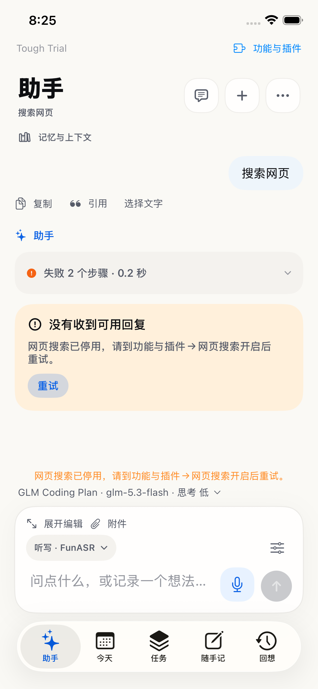
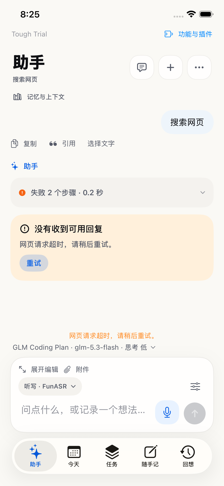
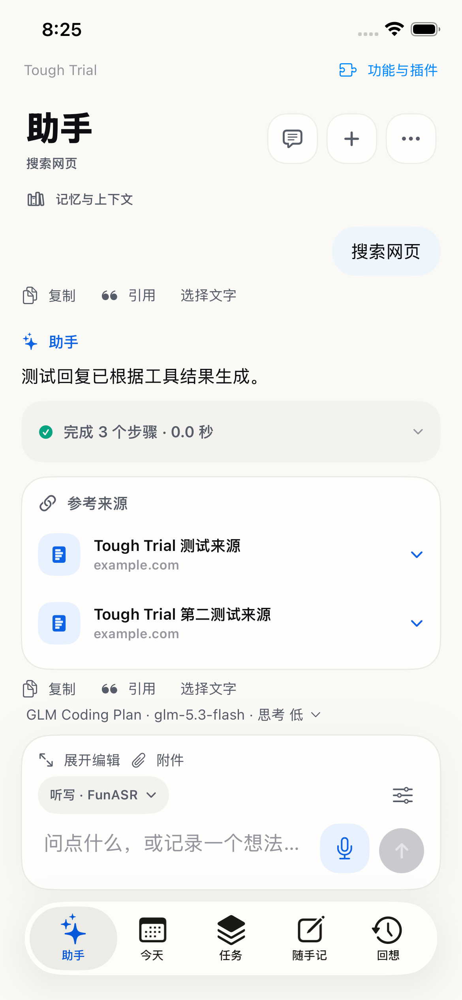
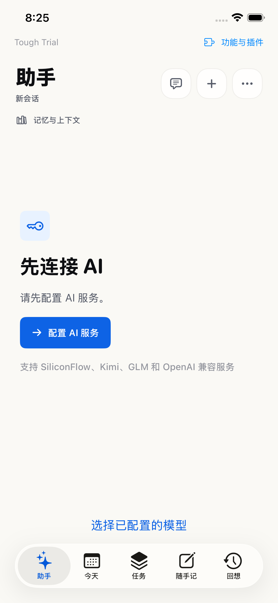
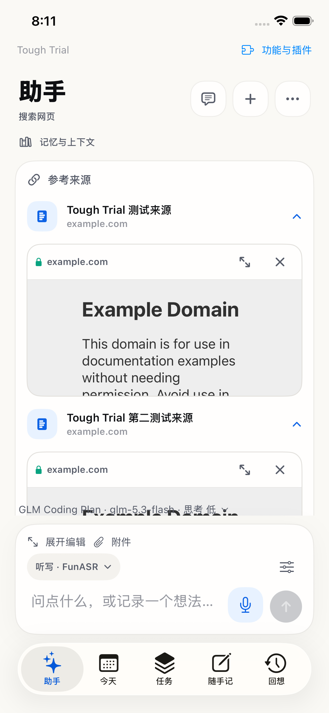
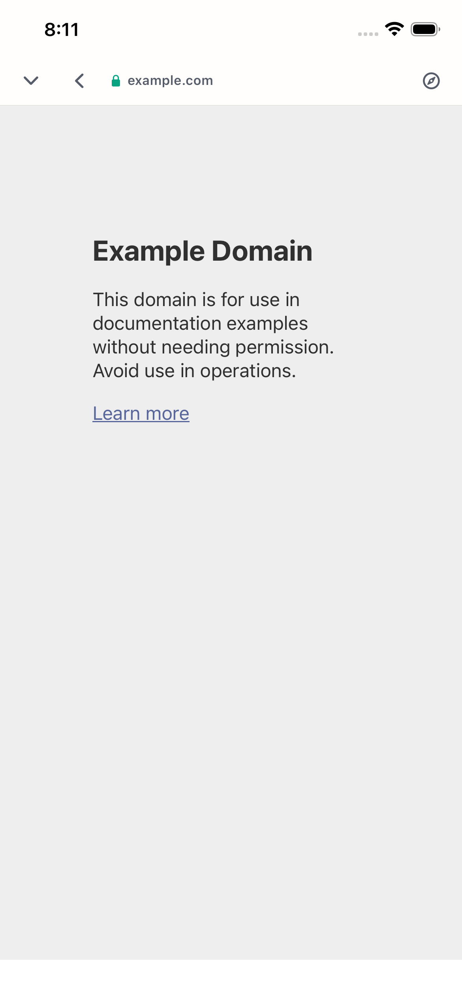

# D 联网能力复验与 E 真机状态

日期：2026-09-12。基线：`baa99a0`。状态：D 本地修复、定向交互验收与生产搜索客户端复验完成；真实模型联网对话及 E 尚未完成。

## 真实链路

生产 `V2DuckDuckGoSearchClient` 使用内置 DuckDuckGo HTML 搜索，独立于 AI 服务，不要求另外配置搜索 API Key。本轮用合成问题“Swift programming language official documentation”运行应用实际 Swift 客户端：1.31 秒返回 3 个来源，首条网页读取成功，得到 307 字符（主要是页面导航，不能据此声称完整文档内容读取通过）。来源为 `docs.swift.org/latest/documentation/`、`developer.apple.com/documentation/swift`、`www.swift.org/documentation/tspl/`。日志 `/private/tmp/tough-ux-d-live-web.log`。此结果证明这台 Mac 当时可访问生产搜索与网页服务，不证明手机网络或模型路由成功。

17e 模拟器已有启用的 SiliconFlow / Qwen3-32B 服务记录，但 App 内检查没有可用的非测试凭据；未把密钥复制到文件或日志。`V2AssistantWebLiveTests` 消耗一次性授权标记后跳过，日志 `/private/tmp/tough-ux-d-live-1.log`。真实模型选择网页工具、基于结果作答仍待有效配置；跳过不计通过。

## 已修复并验证

- 网页停用失败暴露内部模块/调用凭证文本；现在准确说明“功能与插件→网页搜索”。
- 超时/离线等网络失败现在显示清楚的中文原因和重试提示，不能说成 AI 服务没有联网权限。
- 请求将本轮网页能力开关传给模型；空搜索结果进入观察，不编造来源、不误建任务。
- 保留问题、错误与 Trace，重试后能显示来源；用户实际点按来源和展开浏览器。

## 已执行的界面检查

- 17e：未配置 AI 时打开“配置 AI 服务”，再退出设置，引导仍保留，输入区没有假装可用。`/private/tmp/tough-ux-d-ui-sources-2.log` 中该用例通过。
- 17e：点按两个来源、全屏网页、缩小返回，两个内嵌浏览状态保持。`/private/tmp/tough-ux-d-ui-sources-3.log` 通过。搜索结果使用显式 UI fixture；网页截图为实际 WKWebView 页面，不代表真实模型回答。
- 修复前 timeout/停用两条 UI 用例在中文错误和设置路径断言失败，准确红测见 `/private/tmp/tough-ux-d-ui-red-2.log`。修复后实际点按发送→超时→重试→来源、关闭网页→发送→设置提示→开启→重试→来源，均通过；同时检查任务页没有把搜索问题存成任务。
- 等待模型期间关闭网页的搜索/读取两条路径先红后绿：不调用网络依赖，提示状态变化并允许重试，Trace 归属网页失败，不再暴露内部模块凭证。保存失败的内存恢复路径也保留原网络错误。
- 同轮旧“连接后保存配置”用例失败，实际提示 Keychain `-34018`：未签名模拟器不能安全保存凭据，属于已记录的测试环境限制；未绕过安全存储或改成明文保存。配置成功保存仍需签名环境。另一条旧浏览器测试的手势被内嵌网页接收，改为在网页卡片外滚动会话后通过。

## 测试证据

| 范围 | 结果 | 本地日志 |
| --- | --- | --- |
| 核心定向 XCTest | 232 项中 231 通过，1 项因缺少设备导出跳过，0 失败 | `/private/tmp/tough-ux-d-core-final.log` |
| Core/兼容检查与包构建 | 全部通过 | `/private/tmp/tough-ux-d-v2checks.log`、`tough-ux-d-compat.log`、`tough-ux-d-build.log` |
| 助手 App 状态测试，含最终时序修复 | 30 项通过 | `/private/tmp/tough-ux-d-final-3.log` |
| 新增网页 UI：超时重试、停用恢复、未配置引导 | 3 项通过；同轮 2 个 App 失败已修复并由上述最终 30 项复验 | `/private/tmp/tough-ux-d-final-1.log` |
| 两来源展开、全屏、缩回 | 1 项通过 | `/private/tmp/tough-ux-d-ui-sources-3.log` |
| 真实模型会话 | 1 项跳过，无可用非测试凭据 | `/private/tmp/tough-ux-d-live-1.log` |

Xcode 使用 iPhone 17e 模拟器 `342A7FF2-2717-48EA-83DA-92542D3F6CC0`，关闭并行 UI 测试，`CODE_SIGNING_ALLOWED=NO`。可复跑：

```bash
swift test --filter ToughTrialCaptureTests
swift run ToughTrialV2Checks
swift run FocusTimelineCoreChecks
swift build
xcodebuild test -project ToughTrial.xcodeproj -scheme ToughTrial -destination 'platform=iOS Simulator,id=342A7FF2-2717-48EA-83DA-92542D3F6CC0' -parallel-testing-enabled NO -only-testing:ToughTrialV2AppTests/V2AssistantStoreTests -only-testing:ToughTrialUITests/V2AssistantWebUITests -only-testing:ToughTrialUITests/ToughTrialUITests/testAssistantSupportsMultipleInlineBrowsers CODE_SIGNING_ALLOWED=NO
```

真实模型测试需先有可用已保存服务，在模拟器 App 的 tmp 下显式创建一次性 `tough-web-live-check.flag` 后仅运行 `V2AssistantWebLiveTests`；默认跳过。它使用合成问题、内存会话与空领域数据，不修改用户任务。日志路径为本机临时证据，截图随仓库保存。

最终独立代码审查发现的“等待模型期间停用”问题已修复并复核关闭；最终 30 项 App 测试验证该修复。保留通用动作协议，权限由实时模块门禁控制；空网页保留真实 URL 供用户打开，但明确告知没有可引用正文。真实模型是否遵循空结果说明仍属于待验收范围。

## 界面截图













## E 待真机执行

本轮 `xcrun devicectl list devices`：iPhone 13 Pro 显示 unavailable，用户已收到连接并解锁的提示。没有本轮安装/启动回执。

连接后按以下顺序验收，并分别记录构建号、操作与结果：

1. 打开原任务→编辑首段标题→回车写正文→保存→重开；再取消一次、完成/恢复及撤销。
2. 任务与今天各新增一项，确认不同排期语义；真实中文输入法首/中/尾修改，长文与键盘下动作可达。
3. 自然语音连续输入至少 60 秒；手动改字、停止/取消、切页返回，确认不丢字或串草稿。
4. 记账口述“午饭花了三十八，不对，是三十五，昨天的”→真实整理→核对金额/日期/币种→保存→确认或暂缓分类→撤销。
5. 助手真实联网查询→打开来源；网页停用/网络失败→原因与重试；确认没有创建任务或流水。
6. 邀请原反馈用户复走流程。录音、真实模型、手机安装和用户回访分别计状态，不互相替代。
