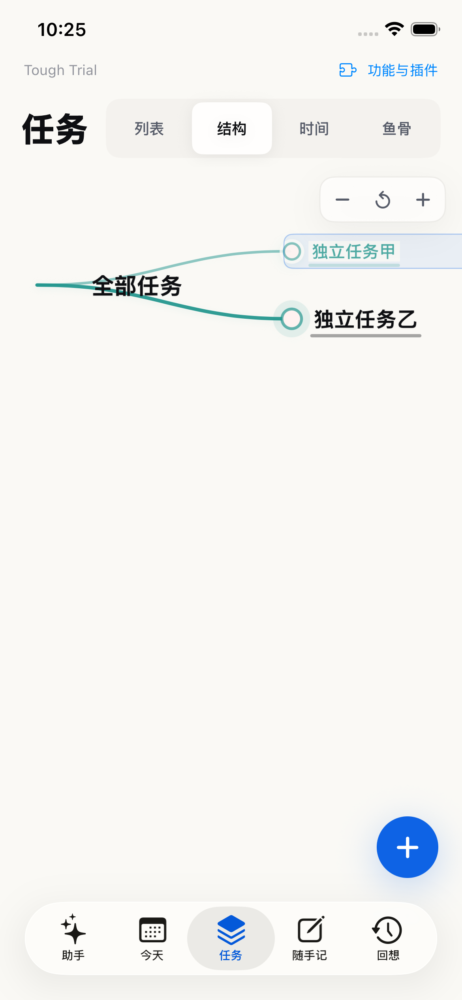

# 四个任务视图验收 · 2026-09-14

用户要求：列表平铺、结构就是树状图，列表/结构/时间/鱼骨同一行并排；手机反馈任务由用户测试后自行标记完成。

## 实现

默认列表，平铺 flattenTasks 的全部任务，父子任务相同左边距，点击标题直接进入详情。结构直接打开总览树，保留展开/收起、缩放与节点详情；视觉根“全部任务”不写入业务数据。列表与结构新增根任务，时间新增保留日期。四个入口有选中反馈和 44pt 高度。

## 手机交付

正常 Debug 版 1.0（13），签名校验通过。已原位安装至 sky / iPhone 13 Pro 并正常启动。安装前后读取快照核对，39 条任务（包括完成状态）完全一致。私有快照仅存 /private/tmp，不纳入仓库。没有执行手机任务的完成操作。

## 验证记录

- `swift run ToughTrialV2Checks`：通过。
- `swift run FocusTimelineCoreChecks`：通过。
- `swift build`：通过。
- iOS 设备构建与 `codesign --verify --deep --strict`：通过。
- 模拟器 iPhone 17e 首批 2 项真实交互：同排四入口及选中反馈、空列表/空树、创建两条独立任务、树图缩放、正文编辑/保存/取消/撤销、标题直接编辑；平铺父子任务、详情修改/取消/继续编辑/保存、完成/恢复/撤销：通过。
- 后续 6 项真实交互全部通过：树图多个分支展开/收起与缩放；助手来源返回任务；大字体长任务；列表完成/撤销、正文重启保留；时间与鱼骨打开同一任务并修改正文；时间入口新增后回列表验证正文。
- 合计 8 项 UI 测试，0 失败。结果包：`/private/tmp/tough-direct-edit-build/Logs/Test/Test-ToughTrial-2026.09.14_22-24-48-+0800.xcresult`、`/private/tmp/tough-direct-edit-build/Logs/Test/Test-ToughTrial-2026.09.14_22-26-42-+0800.xcresult`。

本轮 UI 点按在模拟器执行；手机已正常安装启动并核对数据，手感、真实输入法和用户回访留给用户验收。

