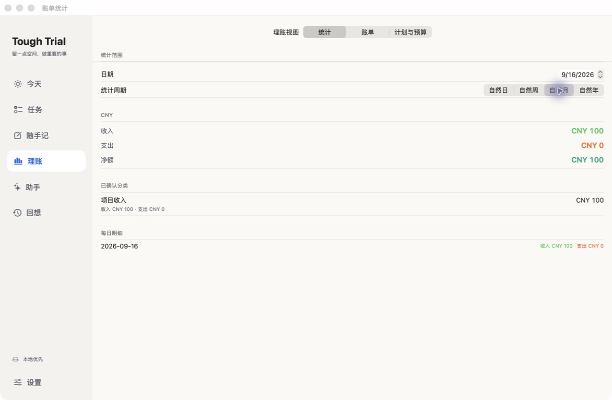

# Mac 完整客户端验收 · 2026-09-16

交付：`outputs/mac/ToughTrialMac-Full-2026-09-16.app`，Apple Silicon、macOS 14+，本机 ad-hoc 签名开发版。不是 App Store/公证发行包。

## 功能与数据边界

原生 SwiftUI 侧栏：今天、任务、随手记、理账、助手、回想、设置。任务列表平铺、结构树、完整时间日历与鱼骨共享核心数据；连续标题/正文输入，支持自动保存、草稿重启恢复、分类/归属/安排与撤销。

同一 MacAppModel 持有 workspace、AppStore、CaptureStore 和 AssistantStore；共用一个 V2Engine。正式资料继续使用 `~/Library/Application Support/ToughTrialMac/`，不自动复制或覆盖手机数据。助手和附件有独立本机文件。GitHub 沿用现有任务/日程 Markdown 同步，财务/笔记/媒体/助手全域同步尚未开发。

统计基础页：公历自然日/周一至周日/月/年；收入、支出、净额，分类与每日明细；币种分离，转账排除，未知日期不使用录入时间替代。标签、分类钻取和趋势图尚未实现。

## 实际运行的验证

- Mac Xcode build 成功，交付包 codesign --verify --deep --strict 成功。
- iOS Simulator build 成功（共享统计与平台适配回归）。
- `swift test --filter 'V2LedgerStatisticsTests|TaskWorkspaceTests'`：24/24 通过（19 任务、5 统计）。
- `xcodebuild ... -only-testing:ToughTrialMacAppTests ... test`：8/8 通过，0 跳过；涵盖同一 engine、跨页保存/重启、新任务草稿、损坏快照保护、退出 flush、计划读取最新正文、系统面板代理、附件字节持久化/重启。
- `swift run ToughTrialV2Checks` 与 `swift run FocusTimelineCoreChecks` 均通过。
- Ontology build/check 成功：44 节点、38 关系；工具 unittest 7/7 通过。
- 最后预览窗口的“完成”按钮补充后重新 Mac build，并实际点击关闭；无需据此声称完整交互自动化已覆盖。

测试日志在 `/tmp/toughtrial-full-unit-tests.log`、`/tmp/toughtrial-mac-full-tests.log`、`/tmp/toughtrial-ios-full-build.log`；Xcode 结果在 `/tmp/toughtrial-mac-full-derived/Logs/Test/`。以上不替代真实云服务验收。

## 实际 UI 与数据检查

使用独立 bundle `com.skyliu.toughtrial.mac.fullqa`，资料目录 `/tmp/toughtrial-full-ui-verification`；仅合成数据。未改动用户真实任务，未调用付费 AI、未上传资料。

| 界面 / 控件 | 实际结果 |
| --- | --- |
| 新增任务、连续标题/正文、保存 | 空标题保存禁用；输入后创建成功，列表与编辑器一致；重启仍在 |
| 今天：任务展开、开始、暂停、结束、完成 | 操作成功；快照存在 4 秒执行片段、已完成状态，任务页同步 |
| 时间尺度 | 从周切月成功，日历显示测试任务 |
| 鱼骨筛选 | 去掉最后一个目标进入空态，重新勾选恢复节点 |
| 结构/列表切换 | 正常；本轮单根任务未验证复杂重排/归属变更 |
| 分类与撤销 | 分类为目标后显示已保存；撤销恢复未分类，快照核对一致 |
| 安排日期 | 今日安排成功，任务出现在今天与日历 |
| 随手记 | 保存原文、切页、重启后保留 |
| 手动记账、分类 | CNY 100 收入保存，手工确认“项目收入”成功 |
| 理账预算 | 2026-09 CNY 500 保存；已用 0、剩余 500，收入未算支出 |
| 统计默认与周期 | 默认本月显示收入 100/支出 0/净额 100、分类与每日明细；日/周/年切换实际点击 |
| 回想输入、真实引用 | 正文与完成任务引用保存到 recallEntries，切页/重启不丢 |
| 助手未配置状态 | 明确显示连接 AI 入口；未伪称真实模型对话通过 |
| GitHub 无效配置 | 空仓库保存显示校验错误，没有上传 |
| 附件选择/取消/预览/关闭/重启 | 成功保存 62 字节合成 TXT、hash 一致；取消不改变已存记录；Quick Look 显示内容，“完成”正常关闭；重启后再次打开成功 |
| Cmd-Q | 无打开编辑窗口时正常退出；重新启动，任务/记录/附件保持 |

## 本轮发现与修复

1. 主窗口代理原先监听所有窗口成为 key，意外覆盖系统文件选择器 delegate。崩溃报告指向 ViewBridge 的 `NSRendezvousWindowRemoteViewDelegate` 释放；现仅绑定 identifier=workspace 且非 NSPanel 的主窗口。加入系统面板 delegate 回归，实测路径弹窗、导入、取消及预览关闭通过。
2. Mac 附件目录 URL 缺少 `isDirectory: true`，与资源存储目录校验不一致导致保存失败。已修复，集成测试和实际字节/hash 验证通过。
3. 助手输入 debounce 不能保证退出时落盘。新增可见草稿同步 flush，保存失败阻止退出。
4. 退出等待助手、捕获、clock/outbox 和前台同步；停止期间阻止再次启动同步。底层快照仍使用原子持久化；不把静态竞态推测表述成已发生数据损坏。
5. 编辑后 AI 计划按稳定 ID 读取最新投影；来源任务选择失败留在助手并提示。
6. Swift 编译器曾在 actor 方法引用形式的 Binding setter 上崩溃，改为显式闭包后编译通过。这与应用运行时 ViewBridge 崩溃分开记录。

## 仍需验证 / 尚未完成

- 自然中文输入法候选、长文/大字体全交互；复杂父子归属/重排、所有时间尺度完整矩阵。
- 真实 AI 服务、浏览器联网/引用、语音输入与麦克风授权、音频播放、系统通知、不同附件类型/分享/批量导入。
- 日期锚点操作、空数据统计的实际 UI、财务计划的完整周期/到期/撤销矩阵；已有领域逻辑测试不能替代这些 UI 验收。
- Mac/iPhone 真实 GitHub 双向同步；全量内容协议、冲突恢复、E2EE、WebDAV/NAS、收费服务。
- Ontology 仍为有边界的人工关系与编译器语法索引，不是全量语义调用图或运行时根因定位。
- iOS 本轮仅编译回归，未更新手机安装包；Mac 长时间稳定性与正式签名发行仍待验证。
