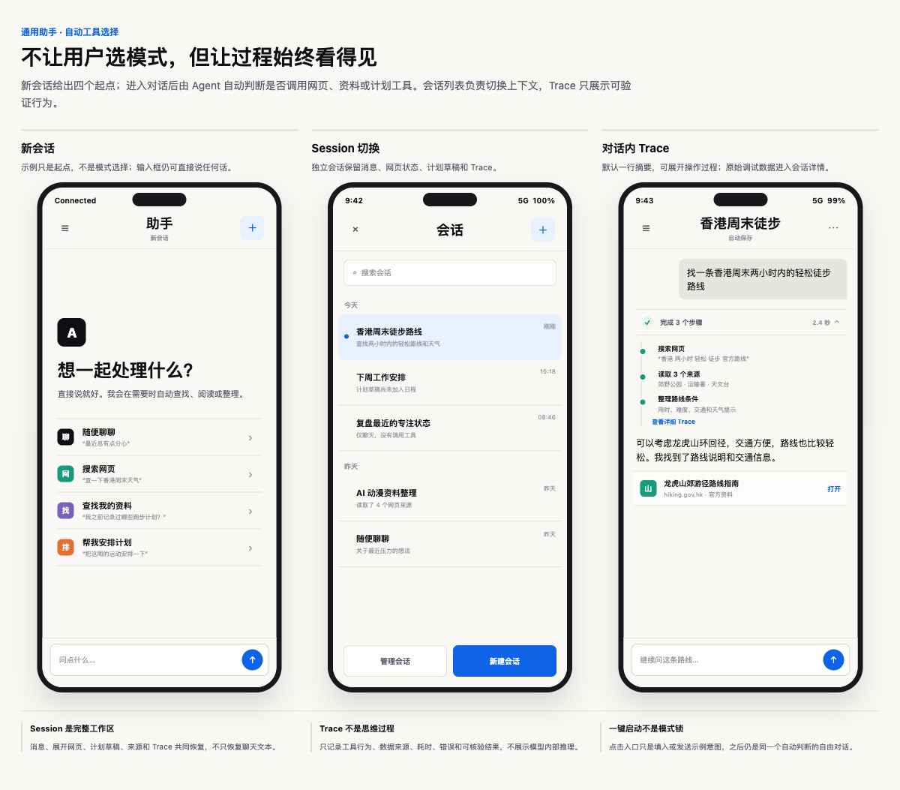
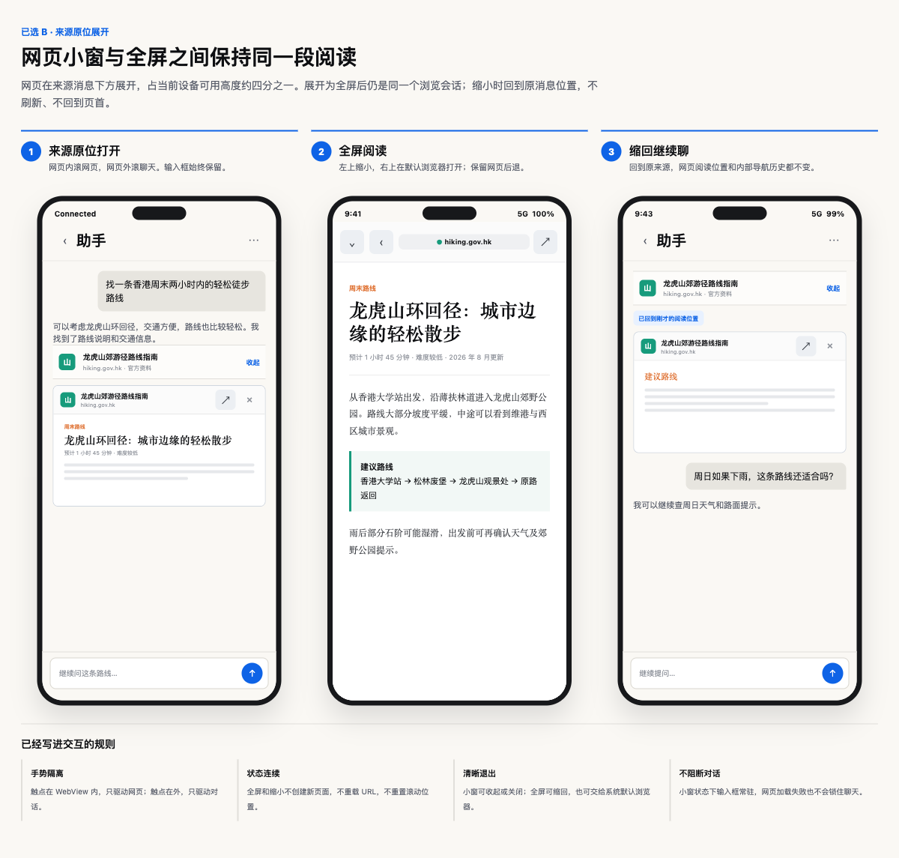

# Tough Trial 通用助手设计 Spec

日期：2026-08-17
状态：首版已实现并通过本地自动验收；等待真实供应商与真机手势确认
范围：将原 `计划` 页面升级为通用 AI 助手；日程计划保留为助手的一项工具
验收记录：[2026-08-17 通用助手 MVP 验收](../../qa/2026-08-17-general-assistant-mvp-acceptance.md)

## 1. 决策摘要

Tough Trial 的第三个主页面从单用途的 `计划` 改为 `助手`。

`助手` 是一个独立、全屏、多 Session 的聊天 Agent 工作区。用户可以直接聊天、搜索网页、查找自己的资料，或生成日程计划。页面不要求用户先选择模式；Agent 根据自然语言自动判断是否需要调用工具。

日程计划不再定义整个页面。它是助手可以生成的一类结构化 artifact，仍遵守原有确认边界：只有用户明确点击 `加入计划`，内容才写入正式任务和日程。

四个主页面的新职责是：

- `今天`：执行今天，记录真实发生。
- `任务`：理解目标、任务结构、过去执行和未来可能路径。
- `助手`：聊天、搜索、资料查找和计划生成。
- `回想`：基于真实证据反思。

## 2. 设计目标

1. 用户进入后可以立刻说话，不需要先选择聊天、搜索或计划模式。
2. 工具调用过程可理解、可追踪，但不把技术细节铺满聊天页面。
3. 多个 Session 彼此隔离，并能恢复消息、来源、网页和计划草稿。
4. 网页来源可以在对话中直接阅读，不迫使用户离开 App。
5. Agent 可以自动执行只读查找，但任何 durable write 仍需用户确认。
6. 保持轻助手气质，不演变成重型项目管理器或完整浏览器自动化产品。

## 3. 非目标

首版明确不包含：

- Agent 自动点击网页、滚动网页、填写表单、登录网站或提交信息。
- 通用 Bash、任意文件系统访问或下载后执行代码。
- 用 iframe 强行嵌入拒绝被嵌入的第三方网站。
- 展示模型内部思维过程或 chain-of-thought。
- 多 Agent 编排、后台长期自治或无人确认的任务写入。
- 把四个一键入口做成会锁定后续对话的模式选择器。

## 4. 页面信息架构

### 4.1 页面入口

底部主导航显示 `助手`。进入后打开独立的全屏工作区，内部不保留底部 tab bar。

顶部区域只保留：

- Session 列表入口。
- 当前 Session 标题。
- 新建 Session。
- 当前 Session 的更多操作。

模型、服务商和调试设置不进入日常对话顶部；它们放在设置或 Session 详情中。

### 4.2 新 Session

新 Session 首屏保持安静，显示一句主提示和四个一键启动项：

- `随便聊聊`
- `搜索网页`
- `查找我的资料`
- `帮我安排计划`

每个入口可以带一句示例 prompt。点击入口只填入或发送该意图，不锁定模式。用户始终可以忽略这些入口，直接在底部输入框说任何话。

参考图：



### 4.3 自动工具选择

助手采用完全自动的工具判断：

- 普通问题直接回答。
- 需要实时信息时调用网页搜索。
- 用户提供 URL 或要求阅读来源时调用网页读取。
- 用户询问自己的记录时查找任务、计划、Memory 或允许访问的资料。
- 用户表达安排、拆解或排期意图时生成计划 artifact。

页面不展示常驻的 `聊天 / 搜索 / 资料 / 计划` 分段控件。Agent 判断不确定时，只提出一个最小必要问题。

## 5. Session 模型

### 5.1 多 Session

用户可以：

- 新建 Session。
- 查看和搜索 Session 列表。
- 在 Session 之间切换。
- 返回未完成的对话、网页阅读和计划草稿。

Session 初始标题取第一条有意义的用户输入；首轮完成后可以自动生成更简短的标题。标题生成失败不影响对话。

### 5.2 Session 保存内容

每个 Session 独立保存：

- 对话消息和消息状态。
- 当前模型会话标识及必要的供应商状态。
- 工具 Trace。
- 网页来源和网页会话。
- 展开、收起和全屏状态。
- 计划 artifact 与 pending 草稿。
- 从任务 item 进入时携带的来源任务上下文。

切换 Session 不能把一个 Session 的网页、草稿、Trace 或模型上下文带入另一个 Session。

### 5.3 恢复边界

- App 进程内切换 Session：必须精确保留 WebView 当前 URL、滚动位置和内部导航历史。
- App 重新启动：必须恢复消息、来源、最后 URL、展开状态和计划草稿；网页滚动位置应恢复，完整网页后退历史首版允许 best effort。
- 页面加载失败不能破坏对应 Session 的消息和来源记录。

## 6. 消息与 Artifact

对话流支持以下内容部件：

- 用户文本。
- Agent 文本。
- Trace 摘要与展开步骤。
- 网页来源列表。
- 内嵌 WebView。
- 结构化计划 artifact。
- 待确认操作。
- 可恢复的错误状态。

Artifact 属于生成它的 Session 和消息位置。它不是脱离对话的另一个页面，也不能因为切换 Session 而丢失上下文。

## 7. 网页搜索与阅读

### 7.1 首版能力范围

网页能力采用“搜索、读取、引用、用户浏览”范围：

1. Agent 发起搜索。
2. Agent 读取允许访问的网页正文。
3. 回答中显示可核验来源。
4. 用户点按来源，在 App 内阅读网页。

Agent 不控制 WebView，不自动点击、滚动、填写或提交网页。

模型服务和搜索服务必须解耦。模型供应商没有原生网页搜索时，可以使用独立搜索工具；不能把某个 Coding Plan 的网页能力假设为所有服务商都具备的功能。

### 7.2 来源原位展开

用户点击来源后，WebView 在对应来源消息下方原位展开：

- 默认高度约为当前设备可用屏幕高度的四分之一。
- 输入框继续固定在页面底部。
- 网页属于当前消息，随聊天内容一起移动。
- 来源行提供收起；WebView 工具栏提供全屏和关闭。

滚动手势严格按触点区域隔离：

- 手势从 WebView 内开始，只滚动网页。
- 手势从 WebView 外开始，只滚动聊天。
- 到达某一层边界时，不自动把同一次手势转交给另一层。

### 7.3 多 WebView

- 多个来源可以同时保持各自的 WebView 展开。
- 每个 WebView 独立保存 URL、滚动位置和浏览历史。
- 同一时刻只有一个 WebView 可以进入全屏。
- 打开另一个全屏网页时，当前全屏网页先缩回原来源位置。
- 离开可视区域的 WebView 可以暂停渲染，但恢复时不能丢失网页状态。

### 7.4 全屏状态

全屏网页顶部提供：

- 缩小并回到原来源位置。
- 网页后退。
- 当前域名和安全状态。
- 使用系统默认浏览器打开。

小窗和全屏使用同一个网页会话。全屏、缩小和 Session 切换不能触发无意义刷新，也不能把网页送回页首。

参考图：



### 7.5 网页能力状态与失败反馈（2026-09-12 D 批次）

每轮助手请求都携带宿主当前的只读网页能力状态。该状态由 `网页搜索` 模块决定，与模型供应商是否自带网页能力无关；可用时允许模型请求独立的搜索/读取服务，停用时模型不得请求网页工具，也不得把停用解释成其他权限、供应商限制或任务写入。停用提示使用准确入口：`网页搜索已停用，请到功能与插件→网页搜索开启后重试。`

网页搜索和网页读取失败时，助手显示简短中文和下一步操作，并区分停用、超时、网络连接中断、HTTP 403/429/5xx 以及响应结构不兼容。模型请求自身的错误仍按 AI 服务错误处理，不套用网页提示。每次失败都在调试 Trace 中记录为对应的 `webSearch` 或 `webRead` 步骤；空搜索结果保留“未找到可用来源”的观察且不生成来源，空正文标记为无可引用内容，不能据此编造事实。用户可以从原消息重试，重试不产生任务或其他持久写入。

## 8. Trace

Trace 分为两层。

### 8.1 用户可读 Trace

聊天中默认只显示一行摘要，例如：

```text
完成 3 个步骤 · 2.4 秒
```

展开后可以看到：

- 搜索使用的查询。
- 读取了哪些来源或本地资料。
- 调用了哪个明确命名的工具。
- 每一步成功、失败或取消状态。
- 可理解的耗时。

这里不展示模型内部推理。

### 8.2 完整调试 Trace

Session 详情提供完整 Trace，供排错和验收使用：

- 供应商和模型。
- 请求、响应和工具事件时间。
- 请求 ID、响应 ID 和会话标识。
- 耗时、重试和取消原因。
- Token 用量与供应商 usage（如果服务返回）。
- 工具名称、参数、结果摘要和错误。
- 与当前消息、来源和 artifact 的关联。

API Key、Authorization header、Cookie、访问令牌和其他凭证永远不能写入 Trace。用户资料正文默认只保存必要摘要；查看原始工具结果时应明确标记敏感内容。

## 9. 计划作为助手工具

原计划页中已经确认的规划逻辑继续有效，但成为助手的一项能力。

计划工具可以从两种入口触发：

- 用户在任意 Session 中自然表达计划意图。
- 用户从任务 item 的 `AI 计划` 进入助手，并携带该任务上下文。

Agent 可以判断是否需要拆解、排期、关联目标、创建周期任务或保留为维护 / 孤立任务。判断过程不暴露成表单。

输出仍然是结构化计划 artifact：

- 自动保存为 pending。
- 可以局部编辑。
- 可以继续用自然语言调整。
- 不因为关闭页面或切换 Session 而丢失。
- 只有点击 `加入计划` 才写入正式任务和日程。

普通聊天、网页搜索和资料查找不会自动生成计划。

## 10. 权限与确认

默认可以自动执行的只读行为：

- 网页搜索和网页正文读取。
- 当前 Session 已允许范围内的任务、计划和 Memory 查询。
- 读取当前对话已经引用的资料。

必须由用户确认的行为：

- 新增、修改或删除任务与日程。
- 接受计划 artifact。
- 把资料写入 Memory。
- 向外部网站提交内容。
- 任何未来新增的外部副作用操作。

首版没有网页提交工具，因此 Agent 即使在网页中识别出表单也不能操作。

## 11. 服务商与能力降级

- AI 未配置时，新会话页显示配置引导，不展示伪造回复。
- 当前模型不支持所需工具时，助手明确说明该能力不可用，并允许继续普通聊天。
- 网页搜索失败时，保留用户问题、失败 Trace 和重试入口。
- 网页加载失败时，保留来源，并提供重试或系统浏览器打开。
- 供应商拒绝请求时展示真实错误，不伪装客户端身份，不回退到演示答案。
- 确定性 Agent 或固定搜索结果只用于自动化测试，不能出现在生产体验中。

## 12. 安全边界

- 外部网页是不可信内容，不能通过 WebView 获得任务、Memory、Keychain 或原生工具权限。
- WebView 不向任意网页暴露通用 JavaScript-to-native bridge。
- 发送给模型的本地资料只包含解决当前问题所需的最小片段。
- 调试 Trace 和导出日志必须脱敏。
- 用户使用系统浏览器打开网页后，App 不追踪其浏览行为。

## 13. 首版验收标准

1. 新 Session 可以直接聊天，不要求选择模式。
2. 四个一键入口只启动示例意图，不锁定后续能力。
3. 至少两个 Session 可以独立对话并正确恢复。
4. Session 切换不会串用消息、Trace、网页或计划草稿。
5. Agent 可以自动选择普通回答或只读工具。
6. 搜索结果包含可点按来源。
7. 来源可以在消息下方以约四分之一屏高度打开。
8. WebView 内外滚动手势互不接管。
9. 至少两个 WebView 可以同时展开并保持独立状态。
10. WebView 全屏、缩小后保留 URL 和滚动位置。
11. 全屏页面可以交给系统默认浏览器打开。
12. 聊天输入框在内嵌网页打开时仍然可用。
13. 用户 Trace 和完整调试 Trace 分层显示。
14. Trace 不包含凭证或模型内部思维。
15. 计划 artifact 只有经用户确认才写入正式任务和日程。
16. 搜索、网页加载或模型请求失败不会丢失 Session。
17. 首版不存在 Agent 自动操作网页的入口或隐藏能力。

## 14. 对当前实现的影响

当前 `V2PlanAgentView`、计划 Client 和 pending 草稿流程可以作为迁移基础，但不能继续把页面状态建模为单一规划阶段。

实施时需要把核心边界调整为：

- `AgentSession`：会话和恢复边界。
- `AgentMessagePart`：文本、Trace、来源、WebView、计划 artifact 和错误。
- `AgentTool`：聊天之外的受控能力。
- `BrowserSession`：每个来源对应的网页状态。
- `AgentTrace`：用户事件和调试事件。
- 现有 `V2PlanDraft`：继续作为计划 artifact 的 durable draft。

供应商配置和计划确认逻辑应复用，不需要为了通用助手重写任务与计划引擎。

## 2026-09-08：助手视觉一致性修订

用户要求助手页与其他主页面一致。复用 V2Theme 的暖色 canvas、surfaceRaised、primary 和圆角标题字体；不另建配色系统。

- 左对齐“助手”页面标题；当前会话作为副标题，会话/新建/返回维持直接入口，低频功能保留更多菜单。
- 与今天/任务页使用接近的 18–22 pt 页面边距、圆角操作按钮和柔和卡片；移除空白页黑色 A 标识及密集列表分割线。
- 空白页保留四类快捷能力，使用紧凑卡片；消息正文保证阅读宽度，用户消息和执行回执的容器圆角保持一致。
- 听写方式与语音设置在输入区直接可见，输入区采用相同圆角/边框层次；沿用 2026-09-08 录后转写规格。
- 保留独立全屏、多会话、网页工具、真实执行/撤销/可选确认行为。本次不调整今天、任务、回想页面的布局。

### 持续对话与处理状态

- 持续聊天沿用相同页面边距、文字角色和圆角。助手回复用轻量身份标识与正文分层，不把长篇回复包成重卡片。
- 等待回复使用圆角处理卡，文案来自真实 activity（理解、搜索、阅读、查找、整理计划/日程）；仅表达处理阶段，不展示模型内部思维或虚构进度。停止入口仍在输入区。
- 已完成的执行记录默认折叠，可展开查看真实步骤、状态与耗时；与引用来源一样采用低强调圆角容器。
- 错误和已取消区分呈现，保留问题与重试入口；日程回执、撤销、严格确认沿用原有行为。
- 视觉验收覆盖多轮对话、处理中、工具记录展开、来源、失败/取消和日程结果，而不只验收空白首页。
