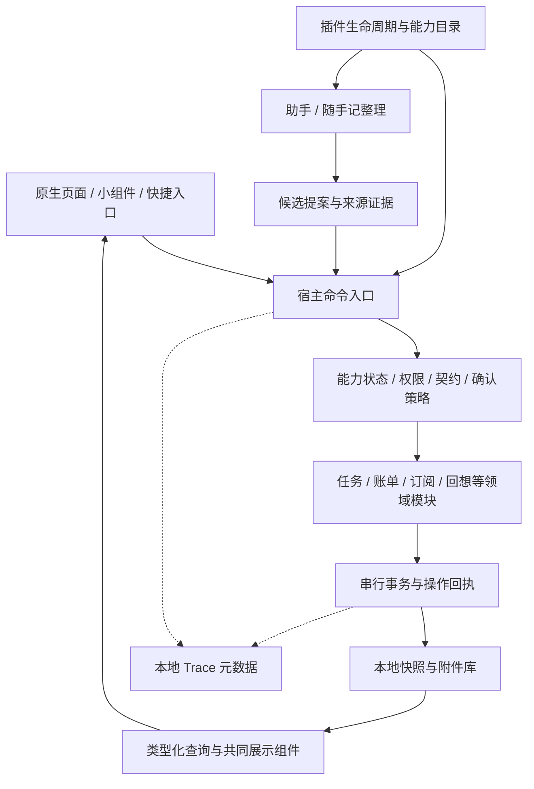

# 插件运行框架与统一数据契约：深化设计

日期：2026-09-10
状态：第一批实现已进入验收：模块可用性、页面显隐、偏好迁移、事务授权及 Finance 命令/回执试点。以下完整目标仍按阶段迁移；实际范围见 [实施计划](../plans/2026-09-10-plugin-runtime-implementation.md)。

承接 [UI / 数据 / AI 分层设计](2026-09-09-unified-capture-and-ledger-design-zh.md) 与 [理账及插件初版](2026-09-10-finance-attachments-plugins.md)。保留已确认的产品约束：轻量输入、点完成再整理、明确请求默认执行并可撤销、严格确认可选、账单分类始终人工确认。本文定义最终架构及迁移路径；代码实现进度与已安装版本分别记录。

## 1. 设计结论

两个框架组成同一套系统：**统一契约负责“数据和操作是否合法”，插件运行框架负责“由谁提供、何时可用、允许谁调用”。**

推荐“小内核 + 随 App 分发的原生业务模块 + 可安装的声明式扩展”。所有入口共用命令执行路径；保持原生 SwiftUI 页面；先复用 `V2Engine` 和本地快照事务，不立即更换数据库或拆成进程。

| 方案 | 能得到什么 | 代价与限制 | 选择 |
| --- | --- | --- | --- |
| 继续只做功能开关 | 快，几乎不移动代码 | 工具、后台任务、数据访问仍分散，不能验证是否真正停用 | 保留为迁移起点 |
| 小内核 + 原生模块 + 声明式扩展 | 统一生命周期、契约、权限、AI 工具；原生体验；可逐功能迁移 | 需要命令边界及契约注册，原生功能更新随 App 发布 | 本轮推荐 |
| 任意第三方脚本运行时 | 可编程自由度高 | 需单独解决隔离、资源限制、分发、平台接口与版本兼容 | 暂不纳入首个运行框架，不预装半成品沙箱 |

“类似 Obsidian”借鉴的是模块注册、设置、扩展与启停体验，不宣称兼容它的 JavaScript 插件或桌面文件权限模型。

## 2. 实施前基线与目标差距

本节保留本轮实施前的代码核对基线，便于评审迁移；不是最新完成清单。最新结果见 [本批验收](../../qa/2026-09-10-plugin-runtime.md)。

| 当前代码 | 已有能力 | 深化后的目标 |
| --- | --- | --- |
| `V2PluginManifest` / `V2PluginStore` | JSON 表单模板、ID 校验、启停持久化、静态依赖 | 兼容版本、生命周期、工具/路由注册、声明式安装范围 |
| `V2FeatureModule.builtins` | 今天/任务/助手等登记；finance → ledger → capture 依赖 | 业务依赖与页面可见性分开，未知 ID 默认不可用 |
| `V2RootView` / `V2CaptureStore` 等 | 页面条件渲染，部分入口检查开关 | 所有命令、后台回调、通知点击、快捷入口在宿主统一检查 |
| `V2CaptureContract` / `V2CaptureClient` | 可写字段派生提示词、严格解析、来源证据及版本校验 | 每个领域登记契约及工具；模型与 UI 不各自复制字段规则 |
| `V2Engine.commit` / `V2FinanceEngine` | 快照复制后保存，支付与流水原子写入 | 串行事务入口、统一操作回执、跨模块的明确事务组 |
| `V2AppSnapshot` / `V2JSONSnapshotStore` | 强类型快照；不支持的顶层版本拒绝加载 | 独立版本记录、迁移预检、保留未知模块数据，防止旧客户端覆盖 |
| `V2UsageTrace` / Capture Trace | 有界本地元数据，关联提案与回执 | 覆盖模块生命周期、权限拒绝、工具耗时、通知排程和迁移 |

特别说明：当前内置代码仍可以直接调用 `V2Engine`。增加一个 Dispatcher 并不自动获得隔离；迁移完成的验收必须包含调用点审计。

## 3. 内核、领域模块和展现层



### 3.1 最小宿主内核

内核不可作为普通插件关闭，否则会失去恢复与数据保护能力。只包含：

- 应用启动、功能管理和恢复入口。
- 模块/契约/工具/页面路由目录。
- 操作身份、授权检查、确认策略和串行事务协调。
- 存储与附件引用基础设施、版本检查、迁移协调、已提交操作回执。
- Trace 发射接口、后台作业登记与取消接口。

持久化回执是去重和撤销的业务数据，不能随着“关闭使用 Trace”一起停止。可关闭的是诊断事件采集与导出；内核不记录未授权的输入正文。

Keychain、系统文件选择、通知、ASR、模型、同步传输由宿主适配器提供。模块拿到的是有限能力句柄，不是 Keychain 密钥、任意路径或整个 `V2AppStore`。

### 3.2 推荐模块划分

以下 ID 是目标逻辑 ID，迁移时映射旧开关；不要求一开始就新建同等数量的 Swift Package。

| 模块 | 拥有的数据/能力 | 必要业务依赖 | 可隐藏的页面或入口 |
| --- | --- | --- | --- |
| `core.tasks` | 任务、目标、排期、执行/Zen、规划草稿及撤销 | 内核；AI 规划为可选能力 | 今天、任务 |
| `core.capture` | 原始记录版本、媒体块、整理批次/来源 | 内核附件服务 | 随手记 |
| `core.ledger` | 流水、分类及分类确认/合并 | 内核 | 理账 |
| `core.finance` | 订阅/待付款计划、支付回执 | ledger | 订阅与还款 |
| `core.budget` | 预算定义；读取账单计算支出 | ledger | 预算 |
| `core.recall` | 当天回想及证据引用 | 内核；tasks 为可选证据源 | 回想 |
| `core.notes` | 灵感、未来想法和 Others 分类结果 | 内核 | 灵感/收纳 |
| `core.assistant` | 会话、工具选择、提案编排 | 内核工具目录 | 助手 |
| `core.web` | 搜索、读取、引用及用户控制的浏览 | 宿主网络适配器 | 助手内网页与搜索 |
| `core.imports` | 导入识别、原件引用、去重批次 | capture | 导入资料 |
| `core.speech` | 录音/转写适配与作业 | 宿主媒体服务 | 听写按钮与设置 |
| `core.sync` | 授权范围内的同步与冲突提案 | 内核；各域同步适配器按需接入 | 同步设置 |
| `core.traceViewer` | 诊断开关、查看与导出 | 内核 Trace 接口 | 使用记录 |

“附件输入”是交互能力开关，附件库及已有原件读取由内核保留。关闭输入不删除或隐藏已经保存的文件。

小组件只负责跳转或提交宿主定义的快捷动作，操作仍由所属领域核验；不在 Widget 中复制账单、任务或权限规则。Dreaming 属于规划建议能力，只能保存草稿，确认后才执行任务域命令。模型提供商、苹果听写与 FunASR 是宿主管理的可替换适配器，不能因隐藏助手页面而失效。

账单允许没有 Capture 来源的手动创建；统一入口创建时附带来源引用。Finance 不依赖 Capture 页，也不依赖助手或语音。Notes、Recall、Tasks 的证据引用在来源模块停用后仍可显示只读摘要。

### 3.3 页面可见与功能停用

- **隐藏入口**：只修改本机布局。领域命令和已授权的 AI 能力仍可用；例如隐藏今天页不影响助手加任务。
- **停用功能**：该模块及缺少必要依赖的模块停止新操作、工具、后台作业和可执行深链；数据保留。
- 依赖停用只改变子模块的有效状态，不改写其用户启用偏好。恢复依赖后按原偏好恢复；可选依赖失效只减少对应能力。
- 开关旁显示实际影响，例如“停用理账，也会暂停订阅还款和预算功能”。对一般启停不弹逐项确认；有未保存输入则先保存，失败时保留输入并说明未完成切换。
- 停用后的历史资料可通过宿主只读保留数据入口查看/导出，不恢复该模块的 AI 工具、作业或写入能力；无法解析的数据只显示文件/记录元信息。
- 所有页面都隐藏时，功能管理仍可到达；助手存在时保持助手入口，否则显示简洁的“选择要使用的功能”。

## 4. 模块契约与注册

### 4.1 原生模块提供什么

目标接口职责如下，名称为拟定，并非已有 SDK：

| 契约 | 注册内容 | 明确不包含 |
| --- | --- | --- |
| `ModuleDescriptor` | 稳定 ID、发布版本、宿主 API 版本、平台、必要/可选依赖、贡献 ID | 密钥、用户记录、任意执行路径 |
| `ModuleDefinition` | 领域契约、命令、查询、页面工厂、事件订阅、迁移清单 | AppStore 或全局可变快照 |
| `CommandDescriptor<Input, Output>` | 输入/结果契约引用、权限、确认下限、事务类型、幂等方式 | 模型返回的确认策略或落库状态 |
| `QueryDescriptor<Input, Projection>` | 只读范围、分页/结果上限、类型化读模型 | 写副作用和隐式全库导出 |
| `ModuleContext` | 受限命令/查询客户端、存储分区、作业登记、取消令牌、Trace 接口 | 可绕过授权的 Engine 引用 |
| `ContributionToken` | 工具、路由、事件、通知/定时作业的可注销登记 | 隐式常驻循环 |

命名使用 `moduleID + localID`；ID 冲突在激活前拒绝。模块注册声明必须无业务写入副作用。工具目录只展示当前调用者可用且已激活的能力。

注册查询与状态视图必须区分 `requestedEnabled / effectiveState / blockedBy`。不能继续让 Toggle 显示“开启”、实际已因依赖停用却没有说明。同步冲突的 AI 建议是可选能力；关闭助手相关能力不应阻止已授权的普通文件同步。

### 4.2 安装版本与声明式包

现有 `schemaVersion: 1` JSON 继续按原语义导入；不能往旧文件悄悄加可执行字段。新增包格式使用独立 `manifestVersion: 2`，与数据 schema 版本分开。

目标最小示例（**设计示例，当前导入器不接受**）：

```json
{
  "manifestVersion": 2,
  "id": "community.reading-note",
  "version": "1.0.0",
  "hostAPIMajor": 1,
  "name": "阅读随记",
  "kind": "declarative",
  "permissions": [{"capability": "capture.create", "scope": "submitted-form"}],
  "contributions": {
    "forms": [{
      "id": "quick-note",
      "fields": [{"id": "book", "type": "text", "required": true}, {"id": "note", "type": "text", "required": true}],
      "submit": {"template": "阅读《{{book}}》：{{note}}", "command": "core.capture.create"}
    }]
  }
}
```

第一阶段声明式包仍限于宿主支持的表单、模板及用户点击的链接。不能声明新的执行器、迁移脚本、SQL、网络请求、任意 SwiftUI 页面或新业务事实类型。表单文本写入标准 Capture；参数模板只能引用已声明字段，单次替换，无循环、函数或递归模板。

后续字段扩展达到第 7 节验收后，可登记受限 FieldDefinition；登记字段并不获得修改核心字段或执行代码的权限。AI 工具由受信任原生模块注册，第三方模板不能自行改写工具策略或系统提示词。

## 5. 生命周期、并发与停用

### 5.1 状态和过程

`installed → validating → ready → active → stopping → disabled`

其他可观察状态：`blocked`（缺依赖、授权或兼容版本）、`failed`（启动/运行错误）、`updating`（正在迁移）。用户启用偏好与运行状态分开存储，不能把“用户想启用”当成“实际已运行”。

激活顺序：检查完整包及版本 → 拓扑校验依赖/循环 → 检查数据迁移 → 获得必要授权 → 建立 Context 和 generation → 注册贡献 → 标记 active。任一步失败，撤销本轮注册；不发布部分工具目录。命令开始执行之前再次检查目标模块，而非仅依赖启动时检查。

停用顺序：

1. 在宿主串行协调器上关闭新请求入口，更新能力目录与路由状态。
2. 撤销旧 generation 的调用资格，取消作业并注销事件。
3. 对已经进入原子提交区的操作等待提交结束；其余在提交前重新检查 generation，拒绝迟到结果。先保存成功的数据按已提交处理，不能显示“已取消”。
4. 移除本模块的待发通知，停止后续排程和重试；不删除其他模块的通知。已经送达的系统通知无法保证撤回，点击时仍由路由校验阻止执行。
5. 收起页面/工具入口并显示有效状态。不能写回来源的编辑器保留输入与失败提示。

每个异步结果都带 `moduleID / generation / operationID`。导入、附件复制等任务也要检查其来源调用资格；已写原件但引用未提交按第 7.4 节恢复。禁止旧 ASR、模型、同步、通知回调因“最终回来了”而绕过停用状态写入。迁移与提交共享串行边界；先确定次序再处理另一操作。

原生模块同进程运行：取消和错误状态是逻辑隔离，不承诺能捕获进程崩溃或强杀不合作的 Swift 代码。插件化第一阶段不以可执行第三方代码为前提。

### 5.2 旧开关的 P0 升级规则

升级前读取 `plugins.disabled`、旧依赖图以及 Trace 实际采集设置，保存原配置备份和 migrationVersion；整个配置转换幂等，重启不能重复计算成另一组偏好。

- 旧 today/tasks 分别映射为今天/任务页面可见性；二者共享任务域，只要原来任一执行入口可用，升级后维持相同可用性，不因合并模块而顺带停掉今天。两个入口原先均停用时，任务域保持停用。
- capture/ledger/finance/budget/assistant/recall/imports/speech/sync 对应逻辑业务模块，同时保留原入口可见性；attachments 对应附件输入开关，trace 对应诊断采集，历史原件与业务回执保持可读。
- 先计算旧图的实际状态。因旧父模块关闭而隐式暂停的模块，保留原 requestedEnabled，并加 `migrationHold=legacyDependencyDisabled`；不能在解除旧 capture 依赖时静默恢复提醒或数据写入。管理页说明“沿用升级前的暂停状态”，由用户一次恢复所选功能后清除 hold。
- community.* 的安装包和各自开关独立保留；只有包能校验且宿主支持才可激活。未知旧 ID 保留诊断信息但 effectiveState=blocked，不映射成默认启用的新能力。
- 不合并旧 Trace 两个开关中的“开启”来覆盖任一个明确停用选择。新的诊断开关保持实际不采集状态，直到用户主动开启。

### 5.3 更新、卸载和重启

- 原生模块更新随 App 发布；声明式更新先校验新包和能力差异，已安装旧版本继续可用直到切换成功。
- 能力不变的已授权更新不重复弹权限；新增权限必须明确展示并获得同意，不能继承为已授权。
- 卸载声明式插件删除定义与本机设置，默认保留已生成的 Capture 和原件。删除用户数据是单独操作。
- 启动时重建目录和作业，不从序列化对象恢复旧内存回调。将中断的命令按持久化回执恢复为已提交或可重试，未知结果不重复执行外部操作。
- 禁止依靠 iOS 常驻进程维持计时；通知走系统调度，前台/可用后台机会做补排。外部副作用的登记、取消和失败恢复归宿主所有。

## 6. 权限与用户确认

调用权限与“这次修改是否需要确认”是两件事。用户不需要每次重新授权同一原生模块；模型也不能通过说“用户已同意”来获得授权。

| 能力 | 范围例子 | 默认处理 |
| --- | --- | --- |
| 数据读取 | 当前原文；最近 7 天账单；指定任务 | 域/对象/字段及数量限制；普通插件不默认获得全库 |
| 数据修改 | 新建 Capture；修改指定任务；计划标记已支付 | 检查命令权限、明确意图、对象版本和命令策略 |
| 媒体读取 | 用户本次选中的 Asset ID 集合 | 使用句柄，不能遍历目录；上传模型是另一项能力 |
| 模型请求 | 指定资料交给已配置提供商 | 宿主管理密钥；可用本地模型时权限语义仍相同 |
| 本地通知 | 某模块计划对应的通知 ID | 系统权限按实际需要请求；停用后停止其排程 |
| 打开链接 | 明确配置的 HTTPS / App 链接 | 用户主动点击；统一 URL 校验，不自动付款/发消息 |
| 同步 | 用户指定仓库、启用的领域及方向 | 新领域首次加入时展示范围；权限不扩展到其他目录或账号 |

确认规则由宿主与领域命令登记为下限，插件声明只能更严格：

- 明确要求的可撤销修改：默认提交、高亮结果并可撤销；严格模式则生成待确认提案。
- 原始随手记和文件保存：用户保存/选择即构成对应输入授权，AI 不可用不影响保存。
- 账单分类、类别细分/合并：始终人工确认；“Others 暂存”不等于确认了正式类别。
- 模糊意图、缺金额/币种/日期、缺证据：待补充。讨论、建议、Dreaming：待确认提案。
- 配置订阅/账单提醒不等于已经付款；“markPaid”只能在用户明确确认已经支付时执行，不能从到期日或点击外部链接推断。
- 系统权限拒绝、模块关闭、数据版本冲突：说明原因与原文去向，不循环请求授权。

声明式包 v1/v2 的 link 仍只支持校验后的 HTTPS；App scheme 只由受信任原生模块为用户配置的链接提供，需宿主登记 scheme/参数规则。插件安装预览列出确切目标域名，更新目标范围不自动继承旧授权。不得把权限表中的“App 链接”解释为第三方模板可自由调用任意 scheme。

权限由命令接收端和结果投影两处执行。来自模板、文件、模型或远端的“确认标记”“模块身份”均不可信；身份由实际调用通道绑定。声明式插件的宿主解释器只能调用白名单动作。这是当前扩展包的技术边界；受信任的原生代码仍需通过访问级别、模块依赖与代码审计防止绕过。

## 7. 统一 Schema：固定事实、受控扩展

### 7.1 权威定义与派生

每个领域拥有自己的强类型事实与命令输入，例如 LedgerEntry、FinancePlan、Task。业务事实不变成一张存任意 JSON 的通用表。

权威来源为领域内的 **Swift 类型 + 与其绑定的契约描述**。契约描述引用字段/CodingKey，登记可写性、约束、证据要求与版本；从注册项生成 AI 参数 Schema、可写字段清单及校验样例。禁止供应商提示词额外维护另一套字段列表。

这不是声称现有 Codable 能自动导出完整 JSON Schema：迁移第一阶段保留现有类型及适配器，用一致性测试验证描述、编码字段和解析器完全匹配；字段漂移必须导致检查失败。遇到新领域，不允许仅手工扩展提示词。

UI 使用 `QueryDescriptor` 的类型化投影和固定组件，布局规则不从 AI 输出生成。原生复杂页面保留专门设计，声明式插件只使用宿主提供的字段编辑器。

### 7.2 版本和扩展字段

| 版本 | 发生变化的原因 |
| --- | --- |
| manifestVersion | 插件包描述结构改变 |
| pluginVersion / hostAPIMajor | 插件发布与宿主接口兼容性 |
| domainSchemaVersion | 领域存储结构/语义变化 |
| commandVersion / contractDigest | 命令输入及执行语义/当前约束集合变化 |
| recordRevision | 用户或 AI 修改了对象内容 |
| taxonomyRevision | 分类定义、归并关系变化 |
| fieldDefinitionsRevision | 扩展字段定义变化 |

受控扩展使用既有设计中的 `attributes[] = {fieldID, value}`；value 只允许 `text / decimal / boolean / date / enumID / recordRef`。FieldDefinition 含 namespaced ID、所属域、类型、显示名、范围/枚举、是否可多值、启用状态、版本。ID 不复用；默认不给分类或 enum 新值自动生效权限。

- 模型只能填写本轮收到的 fieldID，不能自行新增字段或把 amount 塞进 attributes 绕过金额约束。
- 字段停用后历史值保留，UI 可只读显示；类型更改需要显式迁移或新 ID。
- 分类合并改引用/归并映射，不改 LedgerEntry schema，不改变每币种总额。
- 未知模型输出字段拒绝；未知已存/同步模块的数据保留为不可执行的原始载荷。两者处理不能混用。
- `recordRef` 保存目标域与稳定 ID，模块停用不等于目标删除。真正删除目标后展示明确失效引用；不自动连接到同名对象。

### 7.3 数据所有权

逻辑所有权先迁移，物理快照暂不搬家。例如目前 `capture.finance` 的路径保持可读，Finance 模块独占其命令入口；其他模块通过查询/命令访问。重命名模块或隐藏 UI 不重写已有 ID、回执和 Asset ID。

所有附件由宿主按 ID 与 hash 管理，引用可来自多个领域；缩略图/OCR 可重建，原件不可因停用、卸载或重建预览而删除。只有无任何存活引用、无未完成操作引用且满足保留策略后，才允许单独的清理流程。

### 7.4 媒体证据与原件写入

当前文本证据要求 quote 命中 block.text；仅保存图片/PDF 不代表已识别内容。扩展证据合同使用判别联合：`textSpan`（source revision / block / scalar range）、`derivedTextSpan`（原件 ID+hash / 转写或 OCR 版本 / 文本范围）、`assetRegion`（原件 ID+hash / 页码或区域 / 识别提供者与版本）。源修订或原件 hash 变化，旧证据不能直接提交。

识别模块先保存派生文本及其来源，再由整理模块引用；不把转写结果覆盖成原来的手写/录音事实。没有支持的识别器时保留原件与格式图标，标记待识别；媒体模型给出的金额/日期缺少可核对来源时不能自动成为正式事实。

原件写入与快照引用无法跨文件假装同一原子事务：先在宿主附件库写完并校验文件，再提交引用。引用保存失败可能留下孤立文件，恢复/清理只处理已确认无引用的文件；不能反过来先保存指向未完成文件的正式引用。

## 8. AI 能力目录和统一操作协议

### 8.1 模型看到的能力

工具由已激活原生模块登记，例如：

- `core.tasks.create` / `core.tasks.schedule`
- `core.ledger.createPending` / `core.ledger.proposeCategory`
- `core.finance.createPlan` / `core.finance.markPaid`
- `core.budget.set` / `core.budget.queryProgress`
- `core.recall.append` / `core.capture.create`

宿主给每次运行生成有界目录：工具 ID、自然语言用途、输入 Schema、必要约束。先选当前意图相关域，再展开完整参数；选择器不负责授权。遗漏时可查目录补充，不能猜一个没有注册的工具直接调用。模型响应中的工具名只用于查找已授权登记项。

模型的候选提案只含来源、候选 ID、目标命令、用户可写参数和证据。以下可信执行信封由宿主补齐：

```text
operationID / idempotencyKey
actor（manual | assistant | importer | remote）及实际调用模块
commandID + commandVersion + contractDigest
sourceRefs（原文 ID / revision / block / 证据位置）
expectedRevisions + taxonomyRevision + fieldDefinitionsRevision
moduleGeneration / grantRevision
confirmationReceipt（如必要：提案摘要哈希、用户动作与覆盖范围）
```

模型不能生成可信身份、幂等键、确认凭证、完成状态、稳定持久 ID 或文件路径。

### 8.2 执行流程与结果

解析 → 检查模块与权限 → 字段/证据/引用校验 → 明确意图及确认策略 → 展示或提交 → 原子保存事实和回执 → UI 从查询读取结果 → 发出后续作业。

统一结果状态：`applied / pendingConfirmation / needsInformation / blocked / conflict / failed / cancelled`。applied 返回 operationID、实体引用、变化摘要和可用的 undoRef；其他状态不得声称已写入。UI 卡片按此状态渲染，不能从 AI 自然语言中猜执行结果。

助手会话文件和领域快照不在同一事务：事实与回执成功后，即使回复卡片保存失败，也必须显示“操作已保存，回复展示失败”，并可从回执重建；不能提示用户重新执行业务写入。

已有 `V2CaptureReceipt`、`V2ScheduleReceipt`、`V2FinancePayment`、`V2CategoryReceipt`、`V2ExternalImportReceipt` 保留，先由适配层投影成共同 OperationReceipt，并关联 operationID、来源与 trace。不存在撤销实现的操作，其 undoRef 必须为空并说明原因；不能伪造统一 Undo。共同回执首先是读取投影，不另存一套会与真实回执分歧的“成功状态”。

### 8.3 事务与重复处理

- 原始输入保存是独立事务，始终先完成。
- 无相互依赖的提取项可独立处理并分别显示结果。结构解析失败时保留来源版本和错误码，不部分执行无法可信定位的碎片；需要调试模型候选时，由用户选择另存有界诊断材料，默认不保留供应商原始响应或隐藏推理；可独立解析的候选在领域阶段逐项判断。
- 一个明确的多任务修改请求按既有 schedule 原子语义处理；不因模块化偷偷改成逐任务部分成功。
- “确认订阅已支付”包含支付回执、流水、下期日期的推进，作为一个事务组；预算由读取结果计算，无第二套手写余额。撤销也按同组处理。
- Phase 2 对内置跨模块命令使用同一次 `V2Engine.commit`：事务入口必须串行；内部使用不自行保存的 reducer/验证函数，禁止在外层 commit 中嵌套调用会独立保存的公开命令。
- 外部动作不能与本地快照假装原子。通知/同步在提交时登记 outbox 作业；提交后处理并记录结果。失败显示“已保存，提醒/同步待重试”，不回滚已保存的业务事实。
- idempotencyKey 绑定源版本、候选身份和被批准的语义操作；重试返回同一回执。不能把 traceID 当幂等键，也不能对改过参数的操作复用旧 key。并发重复请求在串行入口去重。
- Undo 检查受影响对象的版本与依赖修改；有后续人工修改时不给覆盖式回滚。诊断 Trace 被清空也不影响去重或撤销。

### 8.4 工具、权限或 Schema 在请求中途变化

发请求时记录目录/契约版本，提交前再核对。模块停用或权限收回：blocked，原文和候选保留；目标对象被改：conflict；契约变动：重新验证或重新提取。旧确认凭证只适用于相同提案摘要和范围，不能自动套到修改后的金额或类别上。

## 9. 存储迁移、恢复与同步边界

### 9.1 本地迁移

页面布局、用户启用偏好与授权放本机设置；插件定义的安装清单/版本、字段定义、领域数据和迁移进度进入有版本的受管存储。不能继续把新增的业务资料都塞进 UserDefaults。

先继续单快照原子保存。宿主记录各域 dataVersion，领域模块提供随 App 编译的纯迁移函数；声明式插件不携带可执行迁移。

流程：暂停受影响域写入 → 检查所有迁移版本和依赖 → 保存只读备份/校验摘要 → 在副本迁移 → 校验对象与跨域引用 → 单次替换快照 → 发布新目录及查询缓存。失败保留旧快照与旧状态，不对一半成功的迁移宣告更新完成。

不自动恢复备份覆盖迁移后新增数据。已发生新写入时，只允许前向修复或带具体影响预览的用户恢复流程。插件发布版本回退也不能静默降级数据版本。

### 9.2 未知模块和未来版本

当前 App 遇到不支持的 schema 会拒绝加载；不能宣称已有透传能力。后续存储 envelope 用 `ownerID / dataVersion / records` 分区；内核先识别 envelope，再决定是否解析领域载荷。

未知模块分区以不变的载荷字节、hash 和版本元数据保留，不进入计算/AI 执行，不因保存其他模块而重新编码丢字段。已知域出现未来版本且可能影响核心引用时，该域只读/blocked；未知顶层 envelope 版本则整个文件禁止覆盖，并保留恢复入口。

引入新 envelope 是一次显式升级。老客户端不具备透传能力，启用跨版本同步前必须通过最低客户端版本协商或阻止其上传；不能只升级新客户端然后假定旧客户端安全。

### 9.3 Markdown / GitHub / 云端

继续保留现有 schedule.md 协议；本轮设计不把 ledger、财务或二进制附件塞进该文件，也不把新增 Capture 数据描述为已同步。

下一版同步由领域注册导出/导入适配器，宿主处理传输与版本协商。同步中保留稳定 ID、版本、来源引用、分类确认回执和删除 tombstone；不凭最后写入时间解决账单金额冲突。远端 AI 返回的仍是候选/版本化变更，不能绕过本机确认规则。

跨设备的相同版本幂等去重不等于冲突解决：两台设备并发修改同一来源或付款周期，需要检测冲突并保留两侧证据。语义合并规则按领域制定，预算只在确认后的事实上计算。

插件启用偏好、权限、凭据与用户数据分开。另一设备收到插件数据，不代表自动安装插件、开启它或授权网络。同步原件按 hash 寻址，先获取与校验字节再激活引用；缺附件时显示待下载，不伪装成空内容或已识别。

## 10. Trace 与可观测性

统一关联：`traceID → operationID → proposal / receipt → entityRefs`。嵌套工具另带 parentSpanID；重试使用新的 attemptID，成功语义操作仍保留同一幂等标识。

记录阶段：输入保存、提取开始/结束、契约校验、权限/确认阻塞、提交/撤销、模块启停、后台作业、迁移。元数据含模块/命令/契约版本、耗时、结果码、来源类型、对象引用和数量，不记录录音、图片、账单正文、token、完整 URL 查询参数或模型隐藏推理。

诊断 Trace 默认沿用现有本地 30 天 / 2000 条上限，可关闭和导出。来源正文、提案及业务回执仍在各自域；用户明确选择某条问题时才能把其内容纳入调试材料。重放用只读快照或测试仓库，不再次触发通知、付款记录或外部链接。

## 11. 用户可感知的完整例子

输入：“午饭花了 38 元人民币；今天开通了一个每月 20 美元的订阅，下周才扣费；明天提醒我整理发票。午饭算餐饮。”

| 项目 | 执行结果 | 需要用户做什么 |
| --- | --- | --- |
| 午餐金额与说明 | 保存支出事实，暂归 Others；预算的同币种总支出增加 38 | 确认建议的“餐饮”类别；确认前不进入餐饮分类预算 |
| 订阅 | 提取每月 20 USD 计划候选；缺确切扣费日期或服务名称时保留待补充 | 补齐必要信息；不能把“下周”伪造成某一天，也不生成已付款流水 |
| 明天整理发票 | 明确要求的任务按标准任务命令生成 | 默认可撤销；严格模式先确认，未给具体时间则不编造具体时刻 |
| 话术与外链 | 只在有明确链接/模板时展示为可用动作 | 用户主动点击/复制，不自动发送或支付 |

如果 Ledger 停用，午餐候选显示“理账已停用，原文已保留”，任务仍可完成；如果仅隐藏理账页，授权范围内的记账命令继续可用。用户看到一个整理结果列表，按项显示已完成、待确认、待补充及可撤销状态，不强迫先理解插件依赖树。

## 12. 分阶段迁移与完成标准

| 阶段 | 范围 / 主要接入点 | 完成标准 |
| --- | --- | --- |
| P0：统一可用性判断 | ModuleRegistry、页面偏好与有效状态；适配旧 `V2PluginStore` / Root / 快捷路由 | 未注册 ID 不可用；循环依赖拒绝；隐藏页面不影响领域；停用后所有入口给相同结果；启用恢复保留数据 |
| P1：统一领域契约与调用入口 | 将 Tasks/Schedule、Capture、Ledger、Finance 命令接入 Dispatcher；复用现有类型、回执 | 手动/助手/导入/深链执行同一校验；无 Engine 绕过路径；参数/schema一致性检查通过；拒绝迟到提交 |
| P2：生命周期与事务可靠性 | Context、贡献注销、串行 reducer、outbox、迁移协调；首个完整 Finance 模块 | 支付+流水+周期推进及撤销原子；重复回调不重复记账；停用期间无新提醒/同步；重启恢复正确 |
| P3：AI 能力目录及受控字段 | 从已登记命令生成工具目录；增加财务提案；FieldDefinition 与 typed attributes | 更换模型不改 UI；停用工具不可被旧响应调用；分类确认不能绕过；未知字段/版本不污染正式对象 |
| P4：声明式包 v2 与剩余模块迁移 | 包兼容、能力差异预览、声明式解释器；Notes/Recall/Import/Speech/Sync 等接入 | 旧 v1 文件继续工作；卸载保留资料；所有已注册核心功能通过同一生命周期/权限/查询边界 |
| 后续独立阶段：新同步协议 | 原件传输、域适配、未知分区透传、跨设备冲突、最低版本协商 | 两设备与远端实际测试；未完成前保持 Capture/Finance 本地状态说明 |

P0 具体调用点审计清单：`V2AppStore.openPlanAgent`、`V2AssistantStore.send/retry`、`V2AssistantTurnLoop.execute`、`V2AssistantSchedule.executeSchedule`、`V2CaptureStore.saveQuickTask/saveManualLedger/apply`、`V2ScheduleConflictUI`、`V2RootView.onOpenURL`、AppStore 的 schedule apply 闭包、Finance 表单及各 View 的手动写入。以源代码调用点搜索清单和停用状态的运行测试双重验收；只测 Dispatcher 自身通过不能称为已插件化。当前其中存在未统一检查开关的路径；停用助手还应取消当前回合，而不仅关闭全屏页面。`V2PluginFormView` 的直达 Engine 写入需改为受限 Capture 命令，并附 pluginID 与来源。

P0–P2 优先，不先建设插件市场。实现期间模块先按目录组织；当访问边界和依赖稳定，再逐个提升为 Swift Package target，防止一次拆包影响全部功能。已有数据路径和 UI 组件继续复用。

建议第一个完整迁移对象为 Finance：包含独立数据、Ledger 事务依赖、附件、AI 提案、通知、深链和撤销，能验证框架是否真正打通。第一条可交付用户流程是“说一句订阅计划 → 补必要信息 → 同一订阅页展示 → 到期提醒 → 已付款确认 → 预算联动”。

## 13. 必须覆盖的验收场景

1. 手动与 AI 创建相同任务/账单，在同一状态下 UI 和查询结果一致；禁用任一入口不能绕过规则。
2. 隐藏 Capture 页面，Finance/附件仍工作；停用 Ledger，Finance/Budget 按依赖暂停；恢复后数据和用户偏好不丢。
3. AI/ASR 在飞时停用模块、撤销权限或编辑原文；迟到响应不写入、不丢原文，有明确状态。
4. 同付款周期重复提交、并发提交、崩溃恢复只记一次；金额/类别后续修改后 Undo 拒绝覆盖。
5. 一个任务批次中一项失败时保持原来的整组原子语义；互不依赖的混合输入允许其他项完成。
6. 账单分类确认凭证不可被模型/远端/模板伪造；变更提案后旧确认失效；总预算与分类预算的影响清楚。
7. 新包更新增加读取权限时不静默授权；缺依赖、循环依赖、同名贡献、未来版本均有明确结果。
8. 迁移失败与中途重启保留旧快照；新版本写入后不自动恢复旧备份覆盖用户新增内容。
9. 不支持的分区和原件引用在往返保存中保留；旧客户端不得用不兼容写入覆盖新数据。
10. 注销通知/后台任务只影响所属模块；点旧通知时重新核验模块状态；真实通知和系统文件提供者独立验收。
11. 关闭诊断 Trace 不影响业务回执、去重和撤销；导出的诊断记录不包含内容与密钥。
12. 同一模拟器/真机只能由一个测试执行者占用；代码 worktree 隔离不等于设备隔离。最终报告区分契约检查、模拟器流程与真实外部行为。

## 14. 外部依据与设计边界

- Obsidian 官方示例的 [manifest](https://github.com/obsidianmd/obsidian-sample-plugin/blob/master/manifest.json) 包含稳定 ID、插件版本、最低 App 版本和桌面限制信息；本文仅借鉴显式登记兼容性的做法。
- Apple [App Review Guidelines](https://developer.apple.com/app-store/review/guidelines/#software-requirements) 2.5.2 对动态代码和容器访问设有限制，4.7 同时列出部分非内置软件/插件的路径及附加要求。因此，“iOS 一律不能有脚本插件”并不准确；本文采用原生模块和声明式扩展，是当前产品的实现取舍，不是上架获批保证。若将来引入脚本，需单独核对其分发、数据授权、平台接口与实际审核要求。

开放但不阻塞本设计的产品选择：是否建设公开插件市场、是否让第三方提供可执行脚本、哪些新领域默认开启同步。当前按“本机手动安装声明式包、无第三方执行器、新领域不自动同步”推进设计。
