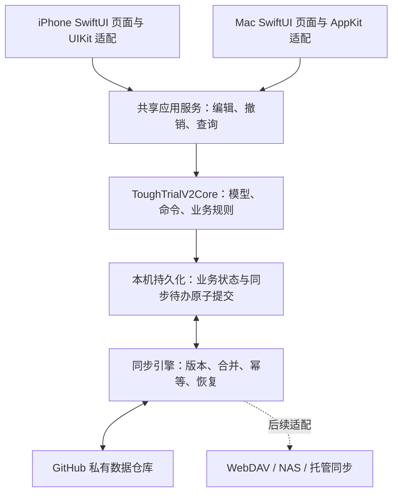

# Tough Trial：Mac 客户端、跨端同步与业务代码本体设计

日期：2026-09-16
状态：用户已于 2026-09-16 确认，进入分阶段实施；完成度以 Roadmap 与验收记录为准。
范围：原生 Mac App、与 iPhone 的内容同步，以及帮助后续 AI 理解业务和定位故障的 Ontology。

## 1. 结论与边界

建议采用 **原生 SwiftUI Mac 客户端 + 共享 Swift 核心 + 独立同步协议 + 可验证的业务代码知识图谱**。

“系统/玩法”在本项目中先指任务、执行、随手记、理账、助手、回想等功能及其交互规则；若后续引入游戏化机制，可增加机制、奖励、资源等概念，无须替换图谱结构。

沿用此前批准的方向：本地数据优先，当前只接入 GitHub，保留 WebDAV/NAS 和未来托管同步的接口。此次设计把“多渠道备份”与“多设备双向同步”分别定义；已有日程同步不能直接当作全量内容同步。

Ontology 的目标是让 AI 回答：

1. 一个业务功能经过哪些页面、命令、数据和函数，与其他系统有什么关系？
2. 一条故障反馈应该先检查哪里，依据是什么，下一步如何验证？

不承诺仅凭一句反馈就准确断言某行代码是根因。不先搭建大型图数据库，也不重写整套 iOS 应用。

## 2. 当前项目的真实基础

以下是本次核对工作区源码的结果，并非新增能力：

| 当前基础 | 已核对位置 | 对方案的影响 |
| --- | --- | --- |
| Swift Package 声明支持 iOS 17 / macOS 14 | `Package.swift` | Core 有复用基础，不代表已经有 Mac App |
| XcodeGen 目前只有 iOS App、扩展和测试目标 | `project.yml` | 需要新增 macOS 应用目标及平台验收 |
| 任务、计划、随手记等核心模型与命令 | `Sources/ToughTrialV2Core/` | 优先共用领域规则与存储契约 |
| JSON 快照、原子保存、schema 迁移 | `V2JSONSnapshotStore.swift`、`V2EngineModels.swift` | 可先扩展事务边界，不为跨端立即更换数据库 |
| GitHub 日程 Markdown 同步和冲突处理 | `V2GitHubScheduleClient.swift`、`V2ScheduleMerge.swift` | 可借鉴经验，但需新的全域同步格式和发布适配器 |
| 模块与命令注册、依赖声明 | `V2ModuleRuntime.swift` | 图谱复用 `core.tasks` 等稳定 ID，不再造模块名录 |
| 使用事件与本地日志 | `V2UsageTrace.swift` | 可扩展关联信息，目前不是完整函数调用链 |
| UIKit / PencilKit / iOS 宿主适配 | `Sources/ToughTrialV2App/` | 原生文本编辑、手写、通知、文件选择等需要平台适配 |

路径未标全时均相对 `Sources/ToughTrialV2Core/`。当前有未提交变更，后续代码索引必须包含工作区内容指纹，不能只用 Git HEAD 代表当前代码。

相关既有约定：[产品入口](../../spec.md)、[本地备份与同步设计](2026-09-14-local-backup-and-sync-design-zh.md)。

## 3. Mac App 的产品与代码结构

### 桌面交互

- 左侧导航：今天、任务、随手记、助手、回想；理账通过随手记进入，按既有产品导航逐步接入。
- 中间工作区：任务顶部并排保留「列表 / 结构 / 时间 / 鱼骨」。列表平铺任务，结构呈现树状关系。
- 右侧详情：选择任务即可连续编辑。第一段是标题，回车后的内容是正文；不要求切换标题/备注字段。窄窗口时详情进入单独页面，返回后保留选择和滚动位置。
- 沿用应用的色彩、字体层级与卡片风格，并适配桌面的鼠标、键盘和窗口尺寸。
- 支持新建、查找、撤销等键盘操作；现有任务编辑在输入组合完成、短暂停顿后提交本地，明显显示保存失败。新任务空白草稿不创建正式任务，关闭或取消时保留/丢弃草稿的行为需一致。
- 自动保存不能覆盖正在输入的草稿：保存携带编辑基准版本；远端更新先保留，存在冲突时显示可比较的两个版本。
- 同步状态尽量安静，只有未同步、失败或冲突需要提示。无网络仍可正常使用。

### 共享边界



建议的新增边界（实施时再创建目录）：

| 边界 | 责任 | 复用策略 |
| --- | --- | --- |
| `ToughTrialV2Core` | 数据模型、命令、校验、撤销、领域合并规则 | 保留现有核心 |
| `ToughTrialAppShared` | 两端都需要的应用服务、编辑草稿状态、主题 | 只提取已经出现的共同需求 |
| `ToughTrialSync` | 同步协调、传输接口、GitHub 适配 | 两端共享；业务合并规则依赖 Core |
| `ToughTrialMacApp` | 桌面窗口、菜单、导航、AppKit 输入与系统能力 | 新增原生目标 |
| 现有 `ToughTrialV2App` | iPhone 页面及设备能力 | 逐步改用共享服务 |

例如 `V2TaskDocumentContent.split` 当前与 UIKit 视图放在同一文件，可提取纯文本逻辑；iOS 继续用 UITextView，Mac 用 NSTextView，复用同一编辑契约。不要把整个 AppStore 直接搬到 Mac，也不要为了复用让每个视图布满平台条件分支。

新增 Mac 目标应单独配置应用标识、沙箱、Keychain、文件访问及网络权限；音频、手写、Live Activity 等按平台能力呈现，不能保留无效按钮。首版以 macOS 14 为候选最低版本，与现有 Package 对齐，进入开发前核对实际测试设备。

## 4. 云同步：先把两台设备可靠连起来

### 4.1 传输渠道选择

| 方案 | 对当前目标的影响 | 本方案选择 |
| --- | --- | --- |
| GitHub 私有数据仓库 | 延续已有选择；应用需要实现版本、合并、重试；适合首期个人文本数据 | 首期采用 |
| CloudKit / CKSyncEngine | 可利用 Apple 的同步调度能力，但仍需处理应用数据与冲突，并引入另一套云服务依赖 | 仅作为改走 Apple 优先路线的候选 |
| 自建/托管同步服务 | 更便于统一后续 Android/Web、设备管理和收费能力，但增加服务运营成本 | 后续阶段 |

Apple 的 [CKSyncEngine 示例](https://github.com/apple/sample-cloudkit-sync-engine) 可作为同步行为的参考，不在本期与 GitHub 并行建设两个主同步通道。

每个资料库只有一个逻辑上的主同步渠道；备份可以写往多个渠道。切换主渠道时需要一致性检查、保留迁移备份，并防止旧客户端继续向旧主渠道写入。

### 4.2 协议与本地事务

同步单位是带版本的业务对象及关联变更批次，不能直接比较两份完整快照的文件时间。

每次变更至少携带：

```text
protocolVersion / entitySchemaVersion
datasetID / deviceID / changeID / batchID
entityType / entityID / operation
parentRevisionIDs / revisionID
payload 或 tombstone / integrityHash
createdAt（展示与审计用途，不作为冲突胜负依据）
```

同一资料库的配对沿用 datasetID，新安装设备生成独立 deviceID。版本关联记录共同祖先；因果关系不能只靠手机时间判断。

写入步骤：

1. UI 提交编辑基准和内容，Core 校验业务规则。
2. 在一次本地持久化事务内保存业务状态、对象版本、同步待办；成功后才显示“已保存到本机”。首期可将这些元数据纳入升级后的同一快照，沿用原子写入。
3. 后台协调器批量发布待办，失败保留并退避重试；恢复网络、进入前台和手动同步均可触发。
4. 接收远端批次，校验格式、对象关系和共同基准，按领域规则合并。
5. 合并结果、已应用 changeID、冲突记录和拉取位置一并落盘，随后刷新页面。重复接收不能重复执行。

现有 `V2Engine.commit` 是重要接入点，但当前 `V2OutboxPolicy` 的副作用待办不能直接当作网络同步队列。新协议应区分数据复制和通知/工具执行；下载、恢复与重试不得重新触发付款、助手写操作或其他外部副作用。

跨多个存储文件的助手、记忆、附件不假装具有同一 JSON 的原子性；接入对应数据域时补上暂存目录、提交清单和崩溃恢复契约。

### 4.3 GitHub 发布与旧日程同步迁移

- 代码仓库与私有数据仓库分开，凭据留在每台设备 Keychain，不进入快照或日志。
- 使用不可变变更包、清单与 Git 提交；发布采用非强制分支更新。如果远端已有新提交，重新拉取、合并再发布，不能 force 覆盖。[GitHub 官方接口](https://docs.github.com/en/rest/git/refs)说明 `force=false` 会要求快进更新。
- 未完成上传的包不能进入可应用清单；远端批次全部校验通过后再落地。退避、限流与中断恢复属于正常状态。
- 全域同步接管任务后，旧 `schedule.md` 改为派生导出；如保留手工导入，必须转成带版本校验的命令。旧客户端需升级或退出该资料库同步，不能让两个协议同时任意写同一批任务。
- 首次连接不能覆盖手机已有内容：两端先做保护备份，再预览加入同一资料库的结果。相同对象 ID 按版本处理；不同 ID 的相似标题不自动去重。
- GitHub 通道按最终一致设计，前台同步可主动触发；不承诺后台秒级到达。Mac 无须充当手机必经的中继服务器。

### 4.4 合并与恢复规则

| 情况 | 默认处理 |
| --- | --- |
| 两端新增不同任务 | 合并保留两条，以稳定 ID 区分 |
| 同一任务的独立属性发生修改 | 有共同祖先且不破坏约束时合并 |
| 同一标题/正文被并发修改 | 标题和正文按一个文档聚合处理；保留两版，用户选择或手动合并 |
| 一端删除、另一端编辑 | 保留 tombstone 和编辑版本，进入待处理状态，不静默复活或丢弃 |
| 父子结构并发变化 | 合并后检查缺失父节点和循环；不合法批次不得部分污染结构 |
| 同一账目金额、币种、分类发生冲突 | 保留两份修订但只计入已确认有效版本，人工确认；不按最后时间覆盖 |
| 运行中的计时与执行记录 | 记录来源设备与稳定事件 ID，已记录事实去重；远端记录不自动启动本机计时器 |
| 不认识的新 schema | 停止应用对应数据域并提示升级，保留原始包与本地数据 |
| 恢复历史版本 | 先创建恢复前保护副本，再以新修订发布恢复结果；不倒退远端分支 |

选择性同步按数据域与附件类型划分。未下载、被排除、模块关闭均不代表删除。墓碑和共同基准的清理需要设备确认及过期设备全量重建机制，不能按短期日志保留天数直接删除。

任务与正文是首个双端验收切片，随后加入独立笔记/随手记，再接理账、助手会话、记忆和附件。首页展示哪些模块与当前已支持的数据范围一致，未接入的内容明确标注“仅本机”，避免用户误以为已经全量同步。

### 4.5 未来付费同步的接口预留

保留版本化传输信封与加密元数据扩展位置；不在首期自创加密算法，也不把 GitHub 私有仓库宣传为端到端加密。

后续托管方案研究：客户端加密与密钥恢复、多设备配对/撤销、加密后的冲突处理、版本保留策略、选择性同步、附件配额与后台限制。服务端只保存密文的目标需要单独威胁模型及实现验收；启用同步不等于授权云端 AI 阅读正文。

## 5. Ontology：把业务含义、实现与证据连接起来

### 5.1 最小概念与关系

| 层次 | 节点 | 例子 |
| --- | --- | --- |
| 业务 | System、Capability、Flow、Surface | `core.tasks`、编辑任务文档、任务详情 |
| 数据与规则 | EntityType、Field、Command、Event、Invariant | Task、title、`core.tasks.update`、标题非空、父子无环 |
| 实现 | Module、File、Symbol、PlatformAdapter | V2Engine、updateTaskClassification、Mac 文本适配器 |
| 验证 | TestCase、Scenario | 编辑后重启仍存在、离线并发编辑 |
| 运行与维护 | Trace、ErrorCode、Build、Incident、Fix | 某次保存失败、对应构建、复现结果与修复提交 |

关系采用有方向、有类型的边：`belongs_to`、`implements`、`invokes`、`reads`、`writes`、`depends_on`、`emits`、`constrained_by`、`verified_by`、`observed_in`、`fixed_by`。

关系是多对多：一个功能常跨多个文件，一个共享函数也服务多个功能。运行时注册依赖、数据引用依赖和 UI 导航关系分别标记，不能统称“依赖”。

每条边记录来源、版本与证据类别：人工审核、编译器解析、运行观测或待验证推断。AI 建议的关系不能自动升级为已确认事实。

### 5.2 两张关联但隔离的图

**开发图谱**随代码保存：业务定义、数据类型、规则、函数、测试和脱敏故障案例，可以随项目开源。

**个人数据图谱**在本机形成受权限控制的派生索引：实际任务属于哪个父任务、来源于哪个随手记、关联哪些记录。真实任务 ID 与业务概念 ID、代码符号 ID 分开；图索引可以从业务数据重建，不作为第二份可编辑数据源，也不默认上传代码仓库。

两者通过 entityType、commandID、featureID 等契约关联。诊断包仅在用户授权范围内附加匿名对象标识和运行信息；不需要为了定位函数上传完整任务正文、账目或聊天。

### 5.3 保存格式与生成方式

建议先采用少量 YAML/JSON 描述 + JSON Schema 校验，开发机生成可查询索引：

```text
ontology/
  schema.json               # 节点、边、来源和版本的约束
  systems/*.yaml            # 业务含义、规则、入口及绑定
  scenarios/*.yaml          # 关键场景、故障样例与验证关系
Tools/OntologyIndexer/      # 后续实现的生成、校验和查询工具
.build/ontology/            # 自动生成的代码索引与 SQLite 查询库，不提交
```

系统 ID、命令、注册依赖首先读取 `V2ModuleRuntime` 等现有契约；YAML 补充语义及绑定，不复制维护另一份命令注册表。Spec 是产品规则来源，图谱引用具体章节；新增概念应回到 Spec 审核。

[SwiftSyntax](https://github.com/swiftlang/swift-syntax) 提取源码结构、签名和范围；[IndexStoreDB](https://github.com/swiftlang/indexstore-db) 查询编译器产生的符号、出现位置和关系。语法树本身不能证明完整调用链，动态分派、闭包和 SwiftUI 状态流需补充人工绑定或运行证据。先提供 CLI 查询，确有多 Agent 客户端需求时再封装 MCP。

符号定位至少保存：模块、完整限定签名、可用时的编译器 USR、文件路径、源码范围、源码摘要、构建配置、代码版本。行号由当前索引生成，不作为永久 ID；重命名可能改变符号标识，应验证绑定并保留迁移记录。

iOS / macOS 分别生成对应构建索引，合并时保留平台条件。发布构建关联 commit 与构建 ID；开发工作区额外带文件内容指纹。版本不匹配就提示重新索引，不把旧位置包装成当前精确行号。

### 5.4 用现有“编辑任务”说明图谱如何落地

当前详情编辑保存链路，经源码核对为：

```text
任务详情点击标题/正文
  → V2TasksView.swift 中 beginEditing()
  → V2TaskEditor + V2TaskDocumentContent.split(_:)
  → V2AppStore.editTask(_:title:note:classification:at:)
  → V2Engine.updateTaskClassification(id:title:note:classification:expectedTask:at:)
  → V2Engine.commit(modules:commandID:_:)
  → V2JSONSnapshotStore.save(_:fileManager:)
  → 返回成功后 refreshProjection(at:) 更新页面
```

`commit` 当前先保存 next 快照，再替换内存 snapshot；此链路不是通过 `persist()` 完成落盘。`editTask` 存在另一重载，图谱必须辨认签名，不可只凭函数短名匹配。

业务映射示意（提案格式，不代表索引工具已实现）：

```yaml
id: capability.tasks.edit_document
system: core.tasks
spec: docs/spec.md
command: core.tasks.update
writes: [Task.title, Task.note, Task.kind]
invariants:
  - 标题不能为空
  - 不可覆盖已经变化的编辑基准
  - 保留任务 ID 与父子位置
bindings:
  - path: Sources/ToughTrialV2App/V2AppStoreTaskEditing.swift
    symbol: "V2AppStore.editTask(_:title:note:classification:at:)"
  - path: Sources/ToughTrialV2Core/V2TaskClassification.swift
    symbol: "V2Engine.updateTaskClassification(id:title:note:classification:expectedTask:at:)"
verification_sources:
  - Tests/ToughTrialV2AppTests/V2TaskClassificationPersistenceTests.swift
  - Tests/ToughTrialUITests/V2TaskDocumentUITests.swift
```

实际生成时将测试文件继续解析到具体用例及断言；“有测试文件”不等于已经覆盖或本次已经运行通过。

## 6. AI 如何根据 Bug 找到函数

以“修改标题后，重开 App 又变回去了”为例，预期流程为：

1. 从反馈识别编辑、持久化、重启场景，找到 `capability.tasks.edit_document`。
2. 读取对应构建的局部子图：输入 → 命令 → 保存 → 加载 → 远端合并。
3. 用同一个 traceID 关联 UI、命令、存储、同步事件，判断链路在哪一步缺失或失败。
4. 给出按证据排序的候选函数、当前文件范围、支持/反对证据、需要执行的最小复现或测试。
5. 复现并验证修复后，将 Incident → 原因符号 → Fix → 回归用例关联，沉淀下一次排查依据。

| 观察到的证据 | 优先排查位置 | 验证方向 |
| --- | --- | --- |
| 输入结束后没有命令提交 | 文档拆分、编辑器保存回调 | 输入法组合、关闭详情、提交基准 |
| 命令报错且没保存成功事件 | AppStore 校验、updateTaskClassification、commit/save | 空标题、旧版本、模块权限、写入失败 |
| 本地保存和重启加载正常，拉取远端后回退 | 同步合并与版本基准 | 并发修订、重复应用、旧协议写入 |

以上是诊断方法，不是对当前 App 已存在此 Bug 的判断。

建议在已有使用记录之外增加精简的结构化诊断事件：traceID、spanID、featureID、commandID、匿名 entityID、changeID、revisionID、buildID、platform、stage、outcome、errorCode。记录提交、保存、读取、发送、接收、合并等关键边界即可，不对每个函数无限打日志。

默认本地保留，提供清理与受控导出；正文、金额、token、密钥不进入通用诊断事件。跨设备通过 changeID/revisionID 关联，并发排序依据版本关系而非日志时间。

开发者的查询入口可以是：

```text
locate-feature "任务点开无法编辑"
trace-data Task.title
diagnose-issue --build <buildID> --trace <traceID>
impact-of-change <symbolID>
```

结果应显示证据来源、索引新鲜度、文件/函数/代码范围和下一步检查。没有日志时降级为静态候选列表，明确缺少什么；不生成没有校准依据的“87% 概率”。查询默认只读，不自动提交修复或读取全部个人数据。

## 7. 防止图谱过期与验证质量

- 业务定义和功能入口由维护者审核；代码符号、文件范围、注册依赖自动生成。
- 代码变更时增量更新索引；CI 检查已纳管功能的绑定能否解析、规则链接是否有效、节点/边类型是否合法。
- 关键功能需要关联具体测试场景；映射完整性与测试运行通过率分别报告。
- 原始调用证据与 AI 推断分开保存；动态关系无法确定时允许 unknown，不制造完整覆盖假象。
- 建立可复现故障样例，测量前 3 个候选是否包含真实原因、定位耗时和所需源码读取量。阶段目标是在已纳管场景中逐步提高，不宣称全项目精准定位。
- 开发索引错误或缺失不能阻断普通用户打开 App；图谱是开发与诊断能力，不成为业务运行的外部依赖。

## 8. 建议的实施顺序与验收

Ontology 跟随每个功能同步建设，不等 App 全部写完再补，也不先给全项目手工画完图再开发。

| 阶段 | 交付 | 验收标准 |
| --- | --- | --- |
| A：最小纵向样板 | 原生 Mac 任务页、连续编辑、离线保存；编辑链路本体与静态查询 | 新建、编辑、撤销、取消草稿、关闭重开实际操作通过；查“编辑任务”能定位 UI、命令、存储及具体测试 |
| B：双端任务同步 | iPhone/Mac 共享协议、GitHub 适配、配对、冲突与保护备份 | 两端离线编辑、并发修改、删除对编辑、断网、杀进程重启、重复接收、时钟偏差和未知 schema 用合成数据验收；均不静默丢失内容 |
| C：其他内容逐域接入 | 随手记/笔记，之后理账、助手、记忆、附件；补齐桌面页面 | 每个域有字段范围、权限与冲突契约；账目不重复计入，附件引用可恢复，界面准确显示本机/已同步范围 |
| D：诊断闭环 | 两端关键事件关联、版本化图谱、故障查询与回归案例 | 注入输入未提交、存储失败、远端覆盖等可控故障；返回匹配版本的候选与证据，并能通过回归测试确认修复 |
| 后续：同步产品化 | WebDAV/NAS、托管服务、E2EE、版本保留与选择性同步套餐 | 单独产品与安全设计，实测移动后台、断点恢复和密钥恢复；不计入首版完成度 |

上述方向已获用户批准；A/B 已进入分阶段实施。当前完成度见 [Roadmap](../../roadmap.md)，不因设计获批将所有阶段标为完成。

## 9. 本次交付状态

2026-09-16 初稿完成源码核对与设计；用户确认后已交付 Mac 离线任务基础版和首条可查询 Ontology。全域双向同步、其他内容与运行诊断仍待实施。

最新实现及真实验证范围见 [首版验收](../../qa/2026-09-16-macos-ontology.md)，设计中的后续能力不代表已开发完成。

## 2026-09-16：Mac 完整客户端实施补充

用户要求从任务基础版推进完整 Mac 客户端。桌面导航接入今天、任务四视图、随手记/账单统计/理账、助手、回想及设置。复用现有应用服务和跨平台 SwiftUI 页面，通过明确的 AppKit、音频和文件适配器接入；不复制另一套业务规则。现有 V2AppStore 暂作为共享应用协调器编译进两个目标，而不是复制到 Mac 目录；后续按真实重复需求提取。所有 Mac 页面共用现有 Mac workspace 的同一个 V2Engine，保持已有本机数据与未完成任务草稿。

PencilKit 手写属于 iOS 平台能力，Mac 用键盘/语音/附件输入，隐藏不能执行的 PencilKit 操作；不将空实现包装成可用功能。现有 GitHub 日程通道可在 Mac 配置与使用，但全域内容同步按前文独立版本协议实施，不能把日程同步标注为全域同步完成。
